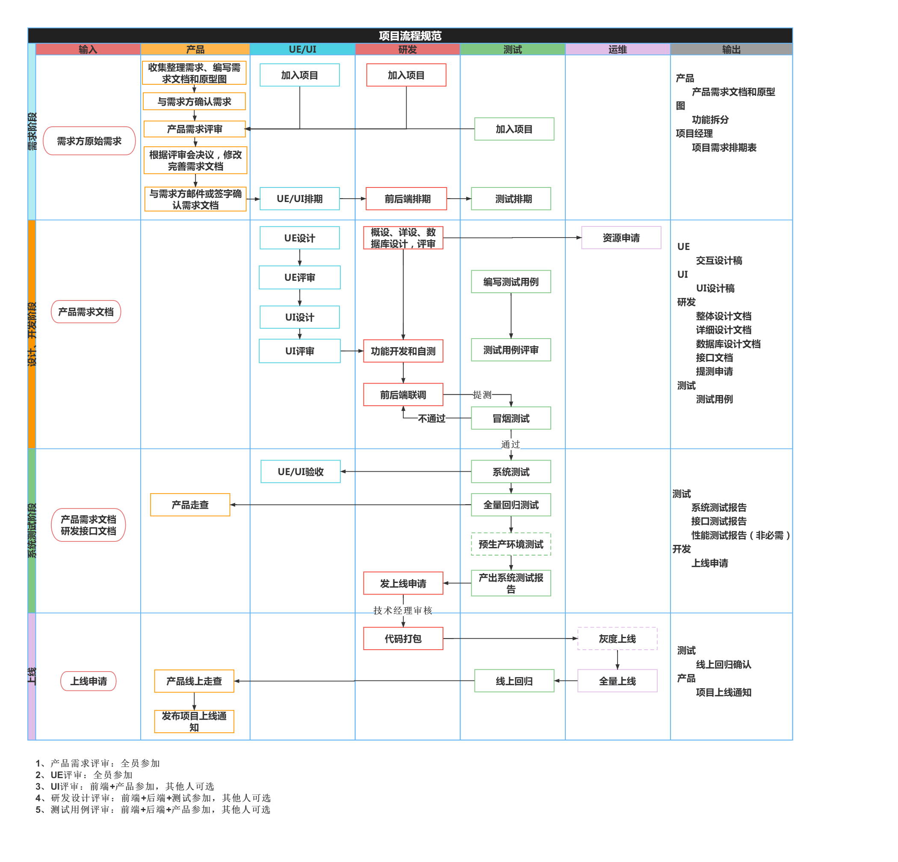

# 项目规范

## 流程规范

## 需求阶段

::: tip 产品经理
明确业务需求，并输出需求文档。
:::

## 开发阶段

::: tip 研发负责人
将需求转化为可运行的系统功能，确保代码质量。
:::

## 测试阶段

::: tip 测试负责人
验证系统的功能和性能，确保上线质量。
:::

## 上线阶段

::: tip 运维负责人
系统稳定上线并交付用户使用。
:::
