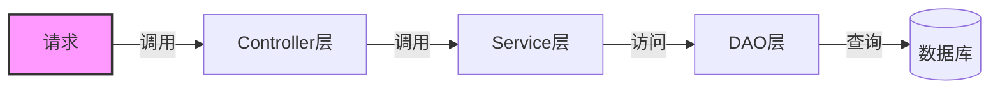
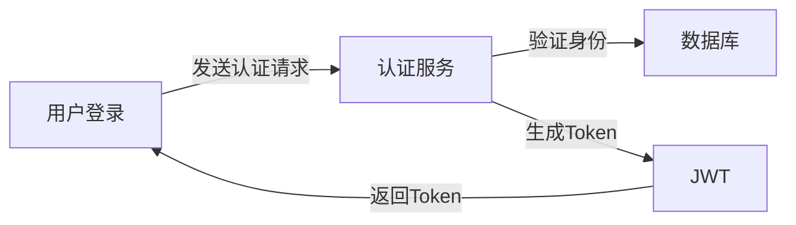
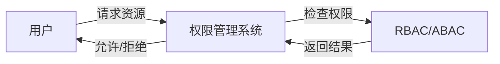
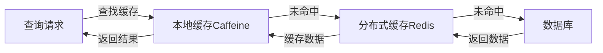
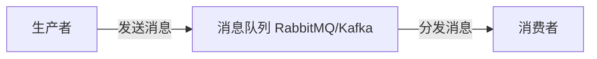

# 服务总览

- 用户管理
- 部门管理
- 权限管理
- 角色管理
- 字典管理
- 操作日志
- 登录认证
- 文件管理
- 消息通知
- 代码生成
- 定时任务
- 接口文档
- 监控管理
- 链路追踪
- 性能监控

在构建和优化 Java 服务时，基础服务的规范和梳理至关重要。本文档将从服务架构、基础服务、中间件及组件、安全机制、监控与告警、测试与部署等方面进行说明，以确保系统的稳定性、可维护性和扩展性。

## 1. 服务架构

### 分层设计

常见分层包括：

- **Controller 层**：处理请求和响应，负责与前端交互。
- **Service 层**：包含业务逻辑，确保业务流程的处理。
- **DAO 层**：与数据库交互，封装数据访问细节。



### 接口规范化

- **API 设计**：统一接口风格，遵循 RESTFUL 标准，保持接口简单、清晰，易于扩展。
- **版本控制**：对 API 进行版本管理，确保向后兼容。

### 模块化

将基础服务按功能模块划分，常见模块包括：

- 用户管理
- 权限管理
- 日志系统
- 文件管理

## 2. 基础服务

### 用户认证

- **功能**：实现用户的增删改查，支持用户认证与授权。
- **技术**：通常结合 Spring Security、JWT 等框架进行安全管理。



### 权限管理

- **功能**：实现细粒度的权限控制，涵盖菜单、按钮、接口权限等。
- **技术**：可基于 RBAC（角色权限控制）或 ABAC（属性权限控制）模型实现。



### 日志管理

- **功能**：记录关键操作和系统日志，用于后期审计和问题排查。
- **技术**：通过 AOP（面向切面编程）实现统一的操作日志管理。

### 任务调度

- **功能**：处理定时任务，如数据清理、报表生成等。
- **技术**：使用 `Spring Task` 或 `Quartz` 实现定时任务调度。

### 文件管理

- **功能**：提供文件上传、下载及存储服务。
- **技术**：可结合云存储（如阿里云 OSS、亚马逊 S3）或本地存储实现。

## 3. 中间件及组件

### 缓存服务

- **功能**：通过缓存提升查询效率，减轻数据库压力。
- **技术**：采用 Caffeine 实现本地缓存，Redis 实现分布式缓存。



### 消息队列

- **功能**：支持异步通信，处理高并发请求，解耦服务之间的依赖。
- **技术**：常用 RabbitMQ、Kafka 等实现消息队列。



### 数据库连接池

- **功能**：管理数据库连接，提高数据库访问性能。
- **技术**：HikariCP、Druid 是常用的数据库连接池方案。

## 4. 配置管理

### 集中化配置

- **功能**：实现配置的集中管理，支持动态更新。
- **技术**：可以使用 Spring Cloud Config、Nacos 等工具。

### 环境区分

- **功能**：区分开发、测试、生产环境的配置，确保不同环境下的配置合理性。
- **技术**：通过 Spring Profiles 进行环境配置管理。

## 5. 安全机制

### 认证与授权

- **功能**：实现用户身份认证与权限控制。
- **技术**：使用 Spring Security 结合 JWT 或 OAuth2 实现。

### 输入校验与安全防护

- **功能**：防止常见的安全漏洞如 SQL 注入、XSS 攻击等。
- **技术**：通过参数校验框架（如 Hibernate Validator）进行输入校验。

### 加密与解密

- **功能**：对敏感数据进行加密，确保数据传输和存储的安全性。
- **技术**：使用如 AES、RSA 等加密算法。

## 6. 监控与告警

### 应用监控

- **功能**：监控服务运行状态，追踪性能指标。
- **技术**：结合 Prometheus、Grafana 进行监控和展示。

### 日志收集与分析

- **功能**：统一收集、存储和分析系统日志。
- **技术**：使用 ELK（Elasticsearch、Logstash、Kibana）或其他日志管理系统。

### 健康检查与告警

- **功能**：提供系统健康检查和故障告警机制。
- **技术**：使用 Spring Boot Actuator 进行健康检查，并结合 Prometheus 实现告警规则。

## 7. 测试与部署

### 单元测试

- **功能**：通过单元测试确保各模块功能的正确性。
- **技术**：采用 JUnit、TestNG 进行自动化测试。

### 集成测试

- **功能**：通过集成测试验证模块间协作的正确性。
- **技术**：结合 Mock 框架（如 Mockito、WireMock）进行集成测试。

### 持续集成与部署

- **功能**：通过 CI/CD 管道实现自动化构建、测试和部署。
- **技术**：Jenkins、GitLab CI 等工具可以实现持续集成和自动化部署。

## maven 依赖

```shell
## 想要查看maven的依赖树的时候使用Maven命令来查看依赖：
maven dependency:tree
## 查看是否有依赖冲突也可以使用Maven命令来查看：
mvn dependency:tree -Dverbose -Dincludes=<groupId>:<artifactId>
```
