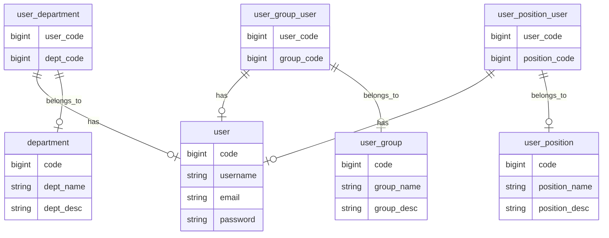
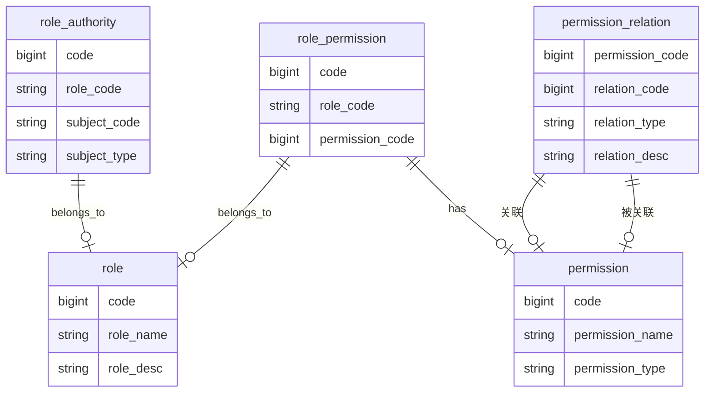
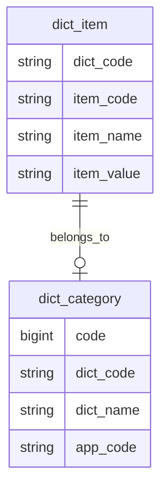
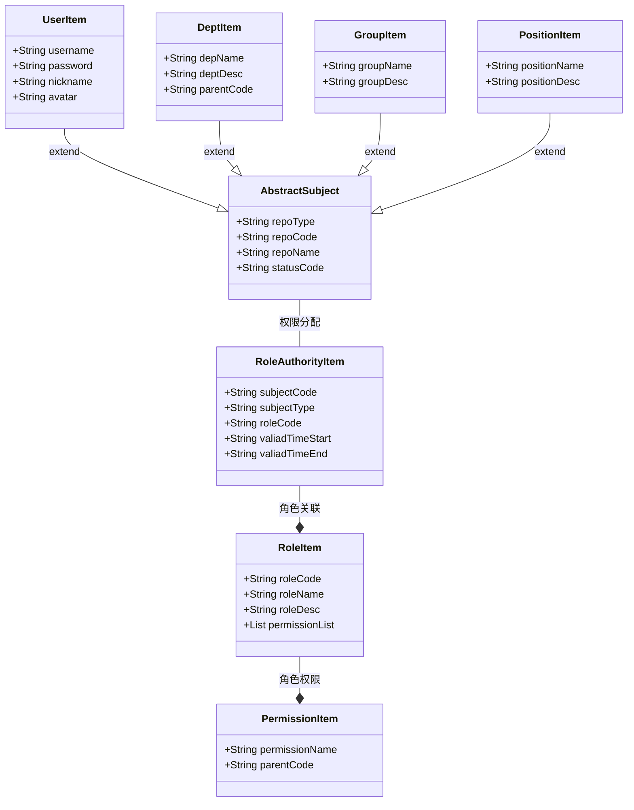
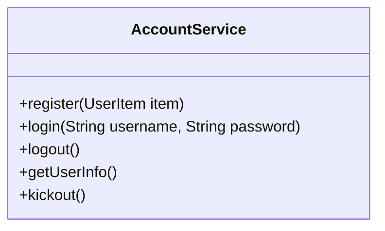
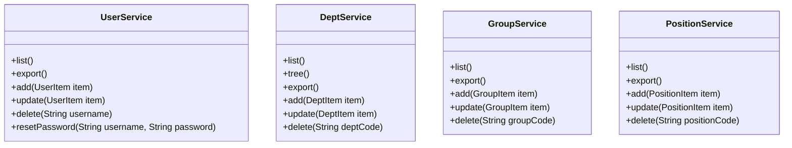
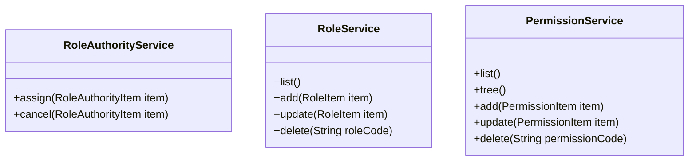

# 用户访问控制 UAC (User Account Control)

## 数据库表设计

### 主体数据 ✔️



::: code-group

```sql [user]
create table if not exists t_user
(
  id            bigint auto_increment comment 'id',
  uniq_code     bigint       default 0                 not null comment '唯一标识',
  username      varchar(128) default ''                not null comment '账号名称',
  nickname      varchar(128) default ''                not null comment '用户姓名',
  user_password varchar(255) default ''                not null comment '密码',
  email         varchar(128) default ''                not null comment '邮箱',
  phone         varchar(32)  default ''                not null comment '手机号码',
  avatar_url    VARCHAR(255) DEFAULT ''                not NULL COMMENT '头像URL',
  user_desc     varchar(255) default ''                not null comment '用户描述',
  status_code   int          default 1                 not null comment '用户状态: 1=启用，2=待定，3=锁定，4=禁用',
  create_by     bigint       default 0                 not null comment '创建人',
  create_time   datetime     default CURRENT_TIMESTAMP not null comment '创建时间',
  update_by     bigint       default 0                 not null comment '更新人',
  update_time   datetime     default CURRENT_TIMESTAMP null on update CURRENT_TIMESTAMP comment '更新时间',
  deleted       int          default 0                 not null comment '是否删除, 0未删除 1已删除',
  primary key (id),
  unique (uniq_code)
) comment '用户表';
```

```sql [department]
create table if not exists t_department
(
  id          bigint auto_increment comment 'id',
  uniq_code   bigint       default 0                 not null comment '唯一编码',
  dept_name   varchar(128) default ''                not null comment '部门名称',
  nickname    varchar(128) default ''                not null comment '部门别名',
  dept_desc   varchar(255) default ''                not null comment '部门描述',
  dept_level  int          default 1                 not null comment '部门等级',
  parent_code bigint       default 0                 not null comment '父级部门code',
  status_code int          default 1                 not null comment '部门状态: 1=启用，2=待定，3=锁定，4=禁用',
  leader_code bigint       default 0                 not null comment '部门负责人',
  create_by   bigint       default 0                 not null comment '创建人',
  create_time datetime     default CURRENT_TIMESTAMP not null comment '创建时间',
  update_by   bigint       default 0                 not null comment '更新人',
  update_time datetime     default CURRENT_TIMESTAMP null on update CURRENT_TIMESTAMP comment '更新时间',
  deleted     int          default 0                 not null comment '是否删除, 0未删除 1已删除',
  primary key (id),
  unique (uniq_code)
) comment '部门表';
```

```sql [department_user]
CREATE TABLE if not exists t_department_user
(
  id          bigint auto_increment comment 'id',
  uniq_code   bigint   default 0                 not null comment '唯一编码',
  user_code   bigint   default 0                 not null comment '用户编码',
  dept_code   BIGINT   default 0                 not null comment '部门编码',
  create_by   bigint   default 0                 not null comment '创建人',
  create_time datetime default CURRENT_TIMESTAMP not null comment '创建时间',
  update_by   bigint   default 0                 not null comment '更新人',
  update_time datetime default CURRENT_TIMESTAMP null on update CURRENT_TIMESTAMP comment '更新时间',
  deleted     int      default 0                 not null comment '是否删除, 0未删除 1已删除',
  primary key (id)
) comment '用户部门表';
```

```sql [user_group]
CREATE TABLE if not exists t_group
(
  id          bigint auto_increment comment 'id',
  uniq_code   bigint       default 0                 not null comment '唯一编码',
  group_name  varchar(128) default ''                not null comment '用户组名称',
  group_desc  varchar(255) default ''                not null comment '用户组描述',
  status_code int          default 1                 not null comment '用户组状态: 1=启用，2=待定，3=锁定，4=禁用',
  create_by   bigint       default 0                 not null comment '创建人',
  create_time datetime     default CURRENT_TIMESTAMP not null comment '创建时间',
  update_by   bigint       default 0                 not null comment '更新人',
  update_time datetime     default CURRENT_TIMESTAMP null on update CURRENT_TIMESTAMP comment '更新时间',
  deleted     int          default 0                 not null comment '是否删除, 0未删除 1已删除',
  primary key (id),
  unique (uniq_code)
) comment '用户组表';
```

```sql [user_group_user]
CREATE TABLE if not exists t_group_user
(
  id          bigint auto_increment comment 'id',
  uniq_code   bigint   default 0                 not null comment '唯一编码',
  group_code  bigint   default 0                 not null comment '用户组编码',
  user_code   bigint   default 0                 not null comment '用户编码',
  create_by   bigint   default 0                 not null comment '创建人',
  create_time datetime default CURRENT_TIMESTAMP not null comment '创建时间',
  update_by   bigint   default 0                 not null comment '更新人',
  update_time datetime default CURRENT_TIMESTAMP null on update CURRENT_TIMESTAMP comment '更新时间',
  deleted     int      default 0                 not null comment '是否删除, 0未删除 1已删除',
  primary key (id)
) comment '用户组-用户关系表';

```

```sql [position]
CREATE TABLE if not exists t_position
(
  id            bigint auto_increment comment 'id',
  uniq_code     bigint       default 0                 not null comment '唯一编码',
  position_name varchar(255) default ''                not null comment '岗位名称',
  position_desc varchar(255) default ''                not null comment '岗位描述',
  status_code   int          default 1                 not null comment '岗位状态: 1=启用，2=待定，3=锁定，4=禁用',
  create_by     bigint       default 0                 not null comment '创建人',
  create_time   datetime     default CURRENT_TIMESTAMP not null comment '创建时间',
  update_by     bigint       default 0                 not null comment '更新人',
  update_time   datetime     default CURRENT_TIMESTAMP null on update CURRENT_TIMESTAMP comment '更新时间',
  deleted       int          default 0                 not null comment '是否删除, 0未删除 1已删除',
  primary key (id),
  unique (uniq_code)
) comment '岗位表';

```

```sql [user_position_user]
CREATE TABLE if not exists t_position_user
(
  id            bigint auto_increment comment 'id',
  uniq_code     bigint   default 0                 not null comment '唯一编码',
  position_code bigint   default 0                 not null comment '岗位编码',
  user_code     bigint   default 0                 not null comment '用户编码',
  dept_code     bigint   default 0                 not null comment '部门编码，0标识应用于全公司',
  create_by     bigint   default 0                 not null comment '创建人',
  create_time   datetime default CURRENT_TIMESTAMP not null comment '创建时间',
  update_by     bigint   default 0                 not null comment '更新人',
  update_time   datetime default CURRENT_TIMESTAMP null on update CURRENT_TIMESTAMP comment '更新时间',
  deleted       int      default 0                 not null comment '是否删除, 0未删除 1已删除',
  primary key (id)
) comment '岗位-用户关系表';

```

:::

### 权限访问控制 ✔️



::: code-group

```sql [role_authority]
CREATE TABLE if not exists a_role_authority
(
  id               bigint auto_increment comment 'id',
  uniq_code        bigint   default 0                 not null comment '唯一编码',
  role_code        bigint   default 0                 not null comment '角色编码',
  subject_code     bigint   default 0                 not null comment '主体编码',
  subject_type     int      default 1                 not null comment '主体类型：1=用户，2=部门，3=岗位，4=用户组',
  valid_time_start datetime default null              null comment '生效时间，NULL 表示没有时间限制',
  valid_time_end   datetime default null              null comment '失效时间，NULL 表示没有过期时间',
  status_code      int      default 1                 not null comment '状态：1=启用，2=禁用',
  create_by        bigint   default 0                 not null comment '创建人',
  create_time      datetime default CURRENT_TIMESTAMP not null comment '创建时间',
  update_by        bigint   default 0                 not null comment '更新人',
  update_time      datetime default CURRENT_TIMESTAMP null on update CURRENT_TIMESTAMP comment '更新时间',
  deleted          int      default 0                 not null comment '是否删除, 0未删除 1已删除',
  primary key (id)
) comment '角色用户表';
```

```sql [role]
CREATE TABLE if not exists a_role
(
  id          bigint auto_increment comment 'id',
  uniq_code   bigint       default 0                 not null comment '唯一编码',
  role_name   varchar(255) default ''                not null comment '角色名称',
  role_desc   varchar(255) default ''                not null comment '角色描述',
  create_by   bigint       default 0                 not null comment '创建人',
  create_time datetime     default CURRENT_TIMESTAMP not null comment '创建时间',
  update_by   bigint       default 0                 not null comment '更新人',
  update_time datetime     default CURRENT_TIMESTAMP null on update CURRENT_TIMESTAMP comment '更新时间',
  deleted     int          default 0                 not null comment '是否删除, 0未删除 1已删除',
  primary key (id),
  unique (uniq_code)
) comment '角色表';
```

```sql [role_permission]
CREATE TABLE if not exists a_role_permission
(
  id              bigint auto_increment comment 'id',
  uniq_code       bigint   default 0                 not null comment '唯一编码',
  role_code       bigint   default 0                 not null comment '角色编码',
  permission_code bigint   default 0                 not null comment '权限编码',
  create_by       bigint   default 0                 not null comment '创建人',
  create_time     datetime default CURRENT_TIMESTAMP not null comment '创建时间',
  update_by       bigint   default 0                 not null comment '更新人',
  update_time     datetime default CURRENT_TIMESTAMP null on update CURRENT_TIMESTAMP comment '更新时间',
  deleted         int      default 0                 not null comment '是否删除, 0未删除 1已删除',
  primary key (id)
) comment '角色权限表';
```

```sql [permission]
CREATE TABLE if not exists a_permission
(
  id              bigint auto_increment comment 'id',
  uniq_code       bigint       default 0                 not null comment '唯一编码',
  permission_name varchar(255) default ''                not null comment '权限名称',
  permission_type int          default 1                 not null comment '权限类型：1=菜单，2=按钮，3=其他',
  status_code     int          default 1                 not null comment '状态：1=启用，2=禁用',
  create_by       bigint       default 0                 not null comment '创建人',
  create_time     datetime     default CURRENT_TIMESTAMP not null comment '创建时间',
  update_by       bigint       default 0                 not null comment '更新人',
  update_time     datetime     default CURRENT_TIMESTAMP null on update CURRENT_TIMESTAMP comment '更新时间',
  deleted         int          default 0                 not null comment '是否删除, 0未删除 1已删除',
  primary key (id),
  unique (uniq_code)
) comment '权限表';
```

```sql [permission_relation]
CREATE TABLE if not exists a_permission_relation
(
  id              bigint auto_increment comment 'id',
  uniq_code       bigint       default 0                 not null comment '唯一编码',
  permission_code bigint       default 0                 not null comment '权限编码',
  relation_code   bigint       default 0                 not null comment '关联编码',
  relation_type   int          default 1                 not null comment '关联类型：1=互斥，2=依赖',
  relation_desc   varchar(255) default ''                not null comment '关联描述',
  create_by       bigint       default 0                 not null comment '创建人',
  create_time     datetime     default CURRENT_TIMESTAMP not null comment '创建时间',
  update_by       bigint       default 0                 not null comment '更新人',
  update_time     datetime     default CURRENT_TIMESTAMP null on update CURRENT_TIMESTAMP comment '更新时间',
  deleted         int          default 0                 not null comment '是否删除, 0未删除 1已删除',
  primary key (id)
) comment '权限关联表';

```

:::

### 其他数据 ✔️



::: code-group

```sql [dict_category]
CREATE TABLE if not exists dict_category
(
  id          bigint auto_increment comment 'id',
  uniq_code   bigint       default 0                 not null comment '唯一编码',
  dict_code   bigint       default 0                 not null comment '字典编码(业务编码)',
  dict_name   varchar(128) default ''                not null comment '字典名称（业务名称）',
  dict_desc   varchar(256) default ''                not null comment '字典描述',
  status_code int          default 1                 not null comment '状态：1=启用，2=禁用',
  app_code    bigint       default 0                 not null comment '应用编码',
  create_by   bigint       default 0                 not null comment '创建人',
  create_time datetime     default CURRENT_TIMESTAMP not null comment '创建时间',
  update_by   bigint       default 0                 not null comment '更新人',
  update_time datetime     default CURRENT_TIMESTAMP null on update CURRENT_TIMESTAMP comment '更新时间',
  deleted     int          default 0                 not null comment '是否删除, 0未删除 1已删除',
  primary key (id),
  unique (uniq_code)
) comment '字典分类表';

```

```sql [dict_item]
CREATE TABLE if not exists dict_item
(
  id          bigint auto_increment comment 'id',
  uniq_code   bigint       default 0                 not null comment '唯一编码',
  dict_code   bigint       default 0                 not null comment '字典分类编码',
  item_code   bigint       default 0                 not null comment '字典项目编码(业务编码)',
  item_name   varchar(128) default ''                not null comment '字典项目名称（业务名称）',
  item_value  varchar(128) default ''                not null comment '字典项目值',
  status_code int          default 1                 not null comment '状态：1=启用，2=禁用',
  app_code    bigint       default 0                 not null comment '应用编码',
  create_by   bigint       default 0                 not null comment '创建人',
  create_time datetime     default CURRENT_TIMESTAMP not null comment '创建时间',
  update_by   bigint       default 0                 not null comment '更新人',
  update_time datetime     default CURRENT_TIMESTAMP null on update CURRENT_TIMESTAMP comment '更新时间',
  deleted     int          default 0                 not null comment '是否删除, 0未删除 1已删除',
  primary key (id)
) comment '字典项目表';
```

:::

## 接口实现

### 登录认证 ❌

| Api      | Method | URL            | 备注 | 完成情况 |
| :------- | ------ | -------------- | ---- | -------- |
| 登录接口 | POST   | `/api/login`   |      |          |
| 用户信息 | GET    | `/api/account` |      |          |

### 组织管理 ❌

- 用户管理（ /manage/organize ）

| Api          | Method | URL                 | 备注 | 完成情况 |
| :----------- | ------ | ------------------- | ---- | -------- |
| 部门列表     | GET    | `/api/depts/list`   |      |          |
| 部门树形结构 | GET    | `/api/depts/tree`   |      |          |
| 部门新增     | POST   | `/api/depts/add`    |      |          |
| 部门重命名   | POST   | `/api/depts/rename` |      |          |
| 部门删除     | POST   | `/api/depts/delete` |      |          |
| 部门管理员   | GET    | `/api/depts/manage` |      |          |
| 用户列表     | GET    | `/api/users/list`   |      |          |
| 用户新增     | POST   | `/api/users/add`    |      |          |
| 用户修改     | POST   | `/api/users/update` |      |          |

- 职位管理 （ /manage/position ）

| Api      | Method | Url                     | 备注 | 完成情况 |
| -------- | ------ | ----------------------- | ---- | -------- |
| 职位列表 | GET    | `/api/positions/list`   |      |          |
| 职位新增 | POST   | `/api/positions/add`    |      |          |
| 职位修改 | POST   | `/api/positions/update` |      |          |
| 职位删除 | POST   | `/api/positions/delete` |      |          |

### 访问控制 ❌

- 权限管理 （ /access/permission ）

| Api          | Method | Url                       | 备注 | 完成情况 |
| ------------ | ------ | ------------------------- | ---- | -------- |
| 权限列表     | GET    | `/api/permissions/list`   |      |          |
| 权限树形结构 | GET    | `/api/permissions/tree`   |      |          |
| 权限新增     | POST   | `/api/permissions/add`    |      |          |
| 权限修改     | POST   | `/api/permissions/update` |      |          |
| 权限删除     | POST   | `/api/permissions/delete` |      |          |

- 角色管理 （ /access/role ）

| Api      | Method | Url                 | 备注 | 完成情况 |
| -------- | ------ | ------------------- | ---- | -------- |
| 角色列表 | GET    | `/api/roles/list`   |      |          |
| 角色新增 | POST   | `/api/roles/add`    |      |          |
| 角色修改 | POST   | `/api/roles/update` |      |          |
| 角色删除 | POST   | `/api/roles/delete` |      |          |

### 系统管理 ❌

- 字典管理 ( /system/dict )

| Api          | Method | Url                             | 备注 | 完成情况 |
| ------------ | ------ | ------------------------------- | ---- | -------- |
| 字典列表     | GET    | `/api/dict/list`                |      |          |
| 字典分类列表 | GET    | `/api/dict/category/list`       |      |          |
| 字典项目列表 | GET    | `/api/dict/category/{dictCode}` |      |          |
| 字典新增     | POST   | `/api/dict/add`                 |      |          |
| 字典修改     | POST   | `/api/dict/update`              |      |          |
| 字典删除     | POST   | `/api/dict/delete`              |      |          |

- 系统日志 ( /system/log )

| Api      | Method | Url                   | 备注 | 完成情况 |
| -------- | ------ | --------------------- | ---- | -------- |
| 日志列表 | GET    | `/api/logs/list`      |      |          |
| 日志详情 | POST   | `/api/logs/{logCode}` |      |          |

## 类设计

### DTO 设计



### Service 设计

- 登录认证



- 组织管理



- 访问控制


