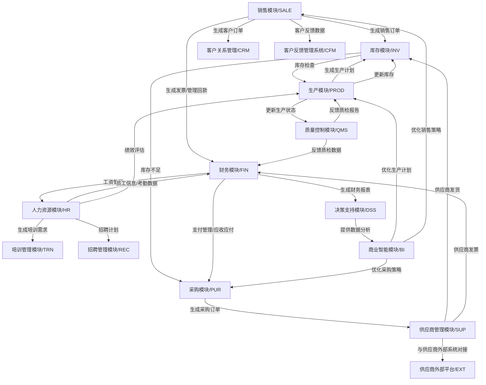
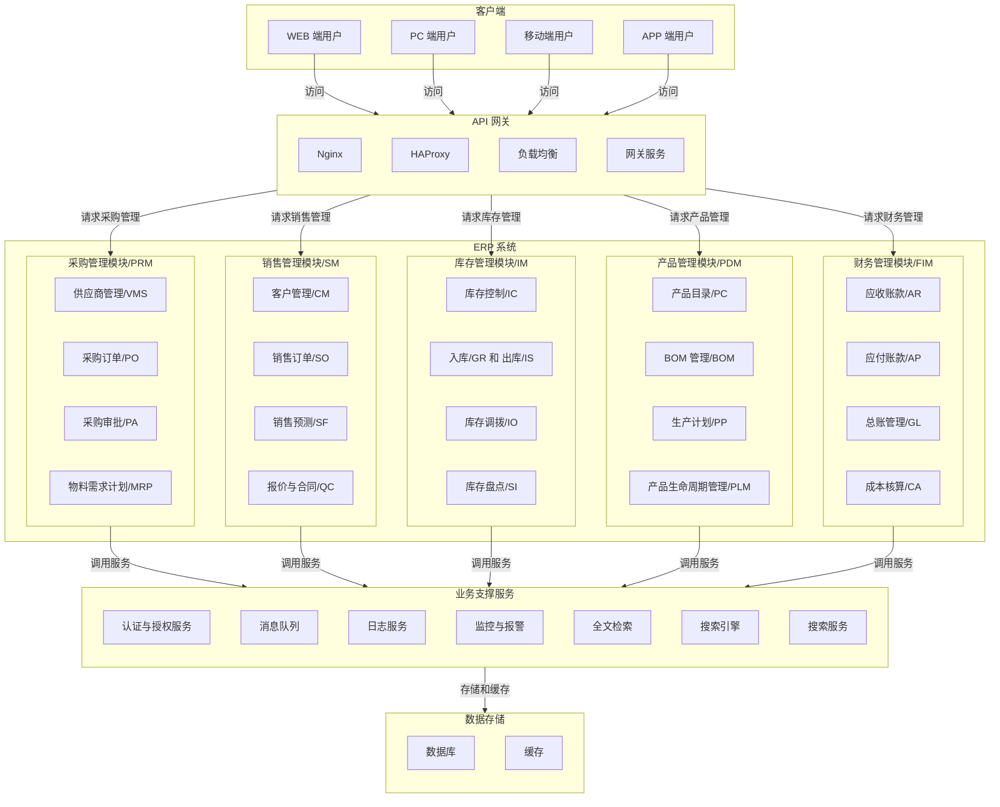
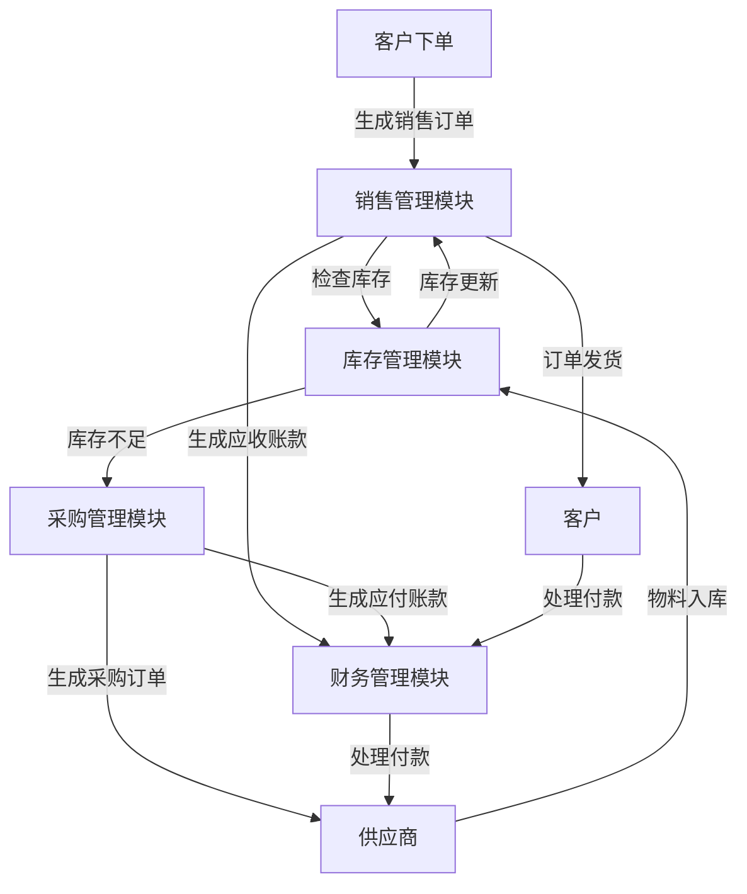

# ERP系统

## ERP系统的定义

> 企业资源计划（Enterprise Resource Planning）系统是一种集成的软件系统，旨在帮助企业管理资源。它可以协调各种不同的业务流程，例如`供应链管理`、`采购`、`库存管理`、`财务`和`人力资源`。通过使用ERP系统，企业可以更加高效地管理其资源，从而提高生产力和效率。此外，ERP系统还可以提供实时数据和分析报告，帮助企业做出更明智的商业决策，实现更好的质量控制、减少错误和浪费、提高客户满意度和增强企业品牌价值。

---

## 架构图

### 产品管理模块 (PDM)

- 产品目录：管理产品信息，包括产品的规格、型号、价格等。
- BOM管理：维护产品的物料清单（BOM），确保生产的准确性。
- 产品销售价格管理：根据销售区域、客户类型等，制定不同的价格策略。
- 生产计划：根据销售订单和库存情况，制定生产计划。
- 产品生命周期管理：跟踪产品从研发到退市的整个生命周期。

### 客户管理模块 (CM)

- 客户管理：记录和管理客户信息，包括历史订单、信用额度等。
- 跟进记录：记录客户与公司的互动，包括电话、邮件和会议等。

### 销售管理模块 (SM)

- 报价单：根据销售订单和库存情况，生成报价单。
- 销售订单：创建销售订单，管理订单的跟踪、发货和结算。
- 销售出库：根据销售订单和库存情况，生成销售出库单。
- 销售退货：处理因质量问题或客户要求退货的订单。
- 销售换货：处理因客户要求更换产品的订单。
- 销售合同：管理销售合同，包括价格、交货期和付款方式等。
- 销售预测：基于历史数据进行销售预测，帮助企业规划生产和采购。

### 采购管理模块 (PRM)

- 物料需求计划：基于库存、生产和销售需求，生成采购计划。
- 供应商管理：管理供应商信息，跟踪供应商绩效，选择最佳供应商。
- 采购申请：创建和管理采购申请，支持多级审批流程。
- 采购审批：支持多级审批流程，确保采购符合公司政策。
- 采购订单：创建、管理和跟踪采购订单，确保物料按时到货。
- 采购入库：接收和存储采购订单，确保物料的准确性。
- 采购退货：处理因质量问题或客户要求退货的物料。

### 库存管理模块 (IM)

- 库存控制：实时跟踪库存数量、位置和状态，支持多仓库管理。
- 入库和出库：处理物料的入库和出库，支持条码扫描、批次管理等。
- 库存调拨：根据销售、采购和生产情况，优化库存水平，减少过剩库存和库存短缺。
- 库存盘点：定期对库存进行盘点，确保数据的准确性。

### 生产管理模块 (PROD)

- 生产计划：根据库存、销售和采购需求，生成生产计划。
- 生产工单：根据生产计划，生成工单并分配给员工。
- 生产领料：根据生产计划和库存情况，生成领料的工单并分配给仓库。
- 生产报工：根据生产计划和员工情况，生成报工的工单并分配给员工。
- 生产入库：根据生产计划执行情况，生成生产入库单。

### 财务管理模块 (FIM)

- 应收账款：管理客户的账单、付款记录和信用控制。
- 应付账款：处理供应商账单、付款和信用额度。
- 总账管理：集成所有财务模块，生成财务报表。
- 成本核算：计算产品生产和采购的成本，分析利润。
- 发票管理：管理发票信息，包括税号、金额等。

## ERP业务流程图

## 5大业务流

1. 【销售流】：客户 → 报价单 → 销售订单 → 销售出库 → 销售退换货 → 对账 → 开票 → 收款
2. 【计划流】：报价单 → 销售订单 → 方案设计 → 产品信息/BOM → 生产计划 → 采购申请、生产任务池
3. 【采购流】：采购申请 → 供应商 → 采购订单 → 采购入库 → 采购退换货 → 对账 → 收票 → 付款
4. 【生产流】：生产任务池 → 生产工单 → 生产领/退料 → 生产报工 → 生产质检 → 生产入库
5. 【仓储流】：仓库 → 其他出入库、调拨、盘点 → 库存

## 9大功能模块

### 1.销售管理

业务流：客户 → 报价单 → 销售订单 → 销售出库 → 销售退换货 → 对账 → 开票 → 收款

> 销售管理是ERP系统的重要组成部分，主要包括销售订单管理、客户管理、销售报表分析等功能。销售管理模块由报价单统计、销售订单统计以及销售执行跟踪看板组成。

- `报价单`：报价是向潜在客户或者客户提供产品或服务价格的一种商业行为。
- `销售订单`：记录了企业销售订单信息的数据表。它记录了下单的时间、销售人员、产品信息、价格及交付要求等详细数据
- `销售出库`：当签署了销售合同以后，就要开始安排给客户发货了。出库单里需要关联销售订单中的合同编号，每笔发货单都要对应到具体的发货合同，保证数据的准确无误。
- `销售退货`：客户因某些原因（如质量问题、不符合需求等）向企业申请退回已购买的商品或服务的过程。
- `销售换货`：销售流程中，由于产品质量或客户需求等原因，客户向企业申请更换已经购买的商品或服务的过程。

### 2.技术管理

业务流程：报价单 → 销售订单 → 方案设计 → 产品信息/BOM → 生产计划 → 采购申请、生产任务池

> 技术管理是ERP系统的重要组成部分，主要包括技术管理、基础设置、信息看板等功能。
>
> 技术管理模块由`方案设计`、`产品信息`、`产品BOM`、`生产工序表单`及`产品列表看板`组成；基础设置模块由产品分类、产品单位与生产班组组成，属于全局基础模块之一。

### 3.计划管理

业务流：报价单 → 销售订单 → 方案设计 → 产品信息/BOM → 生产计划 → 采购申请、生产任务池

> 计划管理主要包括`生产计划`、`生产报表分析`与`辅助表`等模块。
> 辅助表模块由辅助表-子表单行数、生产任务池、委外任务池与装配任务池组成，其中三个任务池表单，由生产计划表单中的数据通过智能助手自动拆分而来。

- `生产计划`：公司整体规划的在某一个相对宽的时间周期内的生产总计划（通常月）。去重计算生产用料需求；集合各环节生产任务；分发生产任务至各任务池。
- `生产计划看板`：生产计划汇总统计，以便于做生产计划调整和规划。
- `装配/生产/委外工单执行跟踪`（派工、报工、合格品、入库）；物料采购状态跟踪；掌握实时进度和问题。
- `生产用料统计`：生产计划、装配/生产/委外工单所需物料的应领、实领统计，以管理物料成本

### 4.采购管理

业务流程：采购申请 → 供应商 → 采购订单 → 采购入库 → 采购退换货 → 对账 → 收票 → 付款

> 采购管理主要包括`采购订单管理`、`供应商管理`、`采购报表分析`等功能
>
> 采购订单管理模块由采购申请、采购订单、采购入库、采购退货、采购需求和订单统计以及采购执行跟踪看板组成。

- `供应商信息`：对供应商基本信息的维护，主要用于采购订单、应付账款、应付款、供应商对账等表单的调用。
- `采购申请`：是企业内部申请采购、增加物料库存或获取内部管理所需物品的一个申请流程。
- `采购订单`：是企业向供应商发出的明确、详细说明所需商品或服务数量、交货日期和价格等有关条款的文件。
- `采购入库`：是指企业在执行采购计划后，将所采购的物料或产品送入仓库并进行清点和确认入库操作的过程。
- `采购退货`：指的是对供应商发出的物料或产品进行退货处理。

### 5.生产管理

业务流程：生产任务池 → 生产工单 → 生产领/退料 → 生产报工 → 生产质检 → 生产入库

> 生产管理模块由生产工单、生产领料、生产退料、生产报工、生产入库以及生产数据统计等内容构成，组成了生产管理闭环。

- `生产工单`：车间/班组根据生产计划制定某一个相对窄的时间周期内的具体生产任务。
- `生产领料`：根据具体生产工单/任务领取生产所需物料。
- `生产退料`：生产工单/任务结束后，退还生产剩余物料。
- `生产报工`：敏捷的实时生产进度报工（通常以班组为单位、日为周期）。
- `生产入库`：完成一批产品生产并通过质检后进行入库。

### 6.委外管理

业务流程：委外任务池 → 委外工单 → 委外领料 → 委外入库

> 委外管理模块由委外工单、委外领料、委外入库以及委外数据统计等表单构成，组成了生产管理闭环。

- `委外工单`：根据生产计划制定的具体生产任务单，指定了委外供应商在某一时间范围内需要完成的生产任务。
- `委外领料`：根据委外工单，列出委外供应商所需的材料及数量清单。
- `委外入库`：完成一批产品生产并通过质检后进行入库。
- `业务流程`：装配任务池 → 装配工单 → 装配领/退料 → 装配报工 → 装配质检 → 装配入库
- `装配管理模块由装配工单`、装配领料、装配退料、装配报工、装配入库以及装配数据统计等表单构成，组成了生产管理闭环。
- `装配工单`：将已计划的装配型生产任务分配给特定班组的过程。
- `装配领料`：在派工后，根据某一装配工单从仓库中领取所需生产物料的过程。
- `装配退料`：将某一装配工单中未使用的原料或半成品退回库存的过程。
- `装配报工`：对各班组的生产过程进行计时、计量（通常以日为单位）的数据。
- `装配入库`：将已完成组装并通过质检的合格产品存储到仓库的过程。

### 7.装配管理

业务流程：装配任务池 → 装配工单 → 装配领/退料 → 装配报工 → 装配质检 → 装配入库

> 装配管理模块由`装配工单`、装配领料`、`装配退料`、`装配报工`、`装配入库`以及`装配数据统计`等表单构成，组成了生产管理闭环。

- `装配工单`：将已计划的装配型生产任务分配给特定班组的过程。
- `装配领料`：在派工后，根据某一装配工单从仓库中领取所需生产物料的过程。
- `装配退料`：将某一装配工单中未使用的原料或半成品退回库存的过程。
- `装配报工`：对各班组的生产过程进行计时、计量（通常以日为单位）的数据。
- `装配入库`：将已完成组装并通过质检的合格产品存储到仓库的过程。

### 8.仓库管理

业务流程：仓库 → 出入库、调拨、盘点 → 库存

> 库存管理模块由仓库管理、其他入库单、其他出库单、库存调拨、库存盘点以及产品出入库/调拨、盘点数据分析等内容组成。

### 9.财务管理

> 财务管理就是企业在财务方面最常见的几项业务，一般来说ERP中的财务管理应该是很全面的，
> 包括`应收应付明细`、`应收应付对账`、`进项发票`、`销项发票`、`收款单`、`付款单`等。
