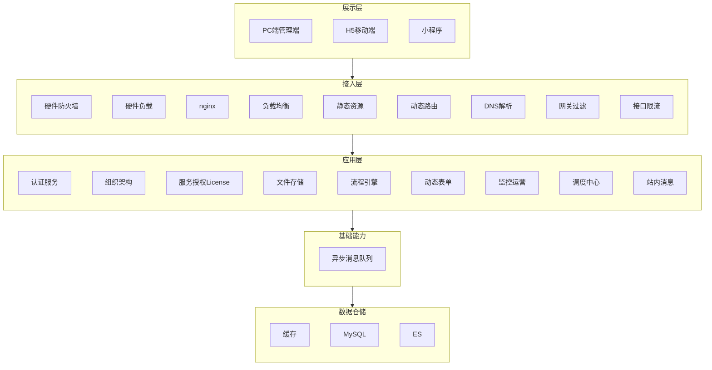

# 系统整体架构

[[toc]]

## 综合架构

```mermaid
graph TB
  subgraph 展示层
    direction TB
    PC端管理端
    H5移动端
    小程序
  end
  subgraph 接入层
    direction TB
    硬件防火墙
    硬件负载
    nginx
    负载均衡
    静态资源
    动态路由
    DNS解析
    网关过滤
    接口限流
  end
  subgraph 应用层
    direction TB
    认证服务
    组织架构
    服务授权License
    文件存储
    流程引擎
    动态表单
    监控运营
    调度中心
    站内消息
  end
  subgraph 基础能力
    direction TB
    异步消息队列

  end
  subgraph 数据仓储
    direction TB
    缓存
    MySQL
    ES
  end
  展示层 --> 接入层
  接入层 --> 应用层
  应用层 --> 基础能力
  基础能力 --> 数据仓储

```
