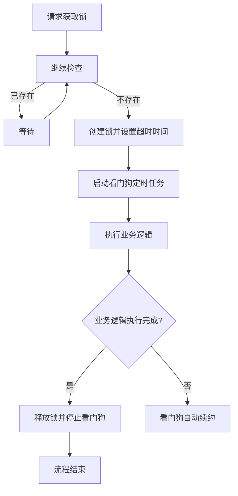

# Redis应用

> Redis 命令: <http://doc.redisfans.com>

## Redis通用命令

```shell
## 客户端连接
redis-cli -h 127.0.0.1 -p 6379 -a 123456

## key 是否存在
exists key
## key 的类型
type key

## 设置有效时间，单位：秒
expire key 5
## 设置有效时间，单位：毫秒
pexpire key 5000
## 设置时间戳，单位：秒
expireat key 1725357887
## 设置时间戳，单位：毫秒
pexpireat key 1725357809000

## 返回有效时间，单位：秒，key 存在但未设置有效时间，则返回-1
ttl key
## 返回有效时间，单位：毫秒，key 不存在，则返回-2
pttl key
## 将 key 从时效性切换为永久性
persist key

## pattern 是匹配模式，若是指定为 `*` 则查询所有 ke
keys *
## 重命名，覆盖式
rename key newkey
## 重命名，newkey 存在则报错
renamenx key newkey
## 返回当前数据库的 key 数量
dbsize
## **清空当前数据库的 key**
flushdb
## **清空所有数据库的 key**
flushall

## 迁移数据 key=a 的数据到1库，超时时间是1s，复制覆盖
mset a a b b c c d d
migrate 127.0.0.1 6379 a 1 1000 copy replace
## 迁移数据 多个key同时迁移
migrate 127.0.0.1 6379 "" 1 1000 copy replace keys a b c d
## 将key=name的数据移动的1库，原库不存在name
set name 123
move anme 1
exists name
```

## 字符串 - string

### 分布式锁

> `SET key value [EX seconds] [PX milliseconds] [NX|XX]`

- `EX second` ：设置键的过期时间为 second 秒。 `SET key value EX second` 效果等同于 `SETEX key second value` 。
- `PX millisecond` ：设置键的过期时间为 millisecond 毫秒。 SET key value PX millisecond 效果等同于 `PSETEX key millisecond value` 。
- `NX` ：只在键不存在时，才对键进行设置操作。 `SET key value NX` 效果等同于 `SETNX key value` 。
- `XX` ：只在键已经存在时，才对键进行设置操作。

```shell
## 获取锁 (key:锁名称，value:线程id，5s后过期，获取成功则返回1，否则返回0)
SET lock_name thread_id NX EX 5
## 看门狗 (为锁续期5s，可定时执行，直到任务结束为止)
EXPIRE lock_name 5
## 释放锁 (原子性操作，只有当key存在且值为当前线程id时，才能成功删除锁)
EVAL "if redis.call('GET', KEYS[1]) == ARGV[1] then return redis.call('DEL', KEYS[1]) else return 0 end" 1 lock_name thread_id
```

### Redis 的 Bitmap 来实现用户活跃情况的统计

```shell
## 用户id为100的用户在2024-09-01登录则记录
SETBIT active:2024-09-01 100 1

## 日活统计（当日活跃用户数）
BITCOUNT active:2024-09-01
## 统计7日活跃用户数
BITOP OR active:7days active:2024-09-02 active:2024-09-03 active:2024-09-04 active:2024-05 active:2024-09-06 active:2024-09-07 active:2024-09-08
BITCOUNT active:7days
## 留存率（次日留存=昨天今天连续登录的人数/昨天登录的人数）
BITOP AND active:retention:2024-09-01+2024-09-02 active:2024-09-01 active:2024-09-02
BITCOUNT active:retention:2024-09-01-2024-09-02
#retention_rate = (连续登录用户数 / 昨天登录用户数) * 100%
```

### 计数器|记分器

```shell
# 增加计数器
INCR counter
# 增加步长5
INCRBY counter 5
# 获取当前计数器值并重置（原子性操作）
GETSET counter 0
# 查看重置后的值，返回 0
GET counter
```

> 限速器

```shell
## 我们希望对某个操作进行限速，例如在 1 分钟内最多允许 10 次请求。

# 1. 使用 INCR 命令增加计数器
INCR "user:123:requests"
# 2. 检查计数器是否是第一次增加 (即当前为1)
# 如果是第一次增加，使用 EXPIRE 设置这个 key 的过期时间为 60 秒
EXPIRE "user:123:requests" 60
# 3. 获取当前计数器的值
GET "user:123:requests"
# 4. 判断计数器值是否超过限制（假设限制是 10 次请求）
# 如果超过，拒绝请求；否则允许请求

## 发现在 INCR 和 EXPIRE 之间存在着一个竞争条件，可以使用lua脚本实现原子性
EVAL "local current = redis.call('INCR', KEYS[1]); if current == 1 then redis.call('EXPIRE', KEYS[1], ARGV[1]); end; return current;" 1 "user:123:requests" 60
```

### 其他场景

```shell
## 验证码记录 (手机号码为18266668888，验证码为123456，有效期为60s)
SET code:18266668888 123456 EX 60

```

## 哈希表 - hash

```shell
## 删除哈希表 key 中的一个或多个指定域，不存在的域将被忽略。
HDEL key field [field ...]
## 查看哈希表 key 中，给定域 field 是否存在。
HEXISTS key field
## 返回哈希表 key 中给定域 field 的值。
HGET key field
## 返回哈希表 key 中，所有的域和值。
HGETALL key
## 为哈希表 key 中的域 field 的值加上增量 increment。
HINCRBY key field 2
## 为哈希表 key 中的域 field 加上浮点数增量 increment。
HINCRBYFLOAT key field 2.2
## 返回哈希表 key 中的所有域。
HKEYS key
## 返回哈希表 key 中域的数量。
HLEN key
## 返回哈希表 key 中，一个或多个给定域的值。
HMGET key field [field ...]
## 同时将多个 field-value (域-值)对设置到哈希表 key 中。不存在则创建，已存在则覆盖。。
HMSET key field value [field value ...]
## 将哈希表 key 中的域 field 的值设为 value 。不存在则创建，已存在则覆盖。
HSET key field value
## 同时将多个域值对设置到哈希表 key 中。不存在则创建，已存在则忽略。
HSETNX key field value [field value ...]
## 返回哈希表 key 中所有域的值。
HVALS key
```

## 列表 - list

```shell
## 在列表 key 的表头插入所有指定的值，如果 key 不存在，那么将会创建一个空列表，再插入数据。
LPUSH key value [value ...]
## 返回列表 key 中，下标为 index 的元素。
LINDEX key index
## 将值 value 插入到列表 key 当中，位于值 pivot 之前或之后。
## 当 pivot 不存在于列表 key 时，不执行任何操作。
## 当 key 不存在时， key 被视为空列表，不执行任何操作。
## 如果 key 不是列表类型，返回一个错误。
LINSERT key BEFORE|AFTER pivot value
## 返回列表 key 的长度。
LLEN key
## 移除并返回列表 key 的头元素。
LPOP key
## 将一个或多个值 value 插入到列表 key 的表头
LPUSH key value [value ...]
## 将值 value 插入到列表 key 的表头，当且仅当 key 存在并且是一个列表。和 LPUSH 命令相反，当 key 不存在时， LPUSHX 命令什么也不做。
LPUSHX key value
## 返回列表 key 中指定区间内的元素，区间以偏移量 start 和 stop 指定。
LRANGE key start stop
## 根据参数 count 的值，移除列表中与参数 value 相等的元素。
## count > 0 : 从表头开始向表尾搜索，移除与 value 相等的元素，数量为 count 。
## count < 0 : 从表尾开始向表头搜索，移除与 value 相等的元素，数量为 count 的绝对值。
## count = 0 : 移除表中所有与 value 相等的值。
LREM  key count value
## 将列表 key 下标为 index 的元素的值设置为 value 。
LSET  key index value
## 对一个列表进行修剪(trim)，就是说，让列表只保留指定区间内的元素，不在指定区间之内的元素都将被删除。
LTRIM key start stop
## 移除并返回列表 key 的尾元素。
RPOP  key
## 将列表 source 中的最后一个元素(尾元素)弹出，并返回给客户端。将 source 弹出的元素插入到列表 destination ，作为 destination 列表的的头元素。
RPOPLPUSH source destination
## 将一个或多个值 value 插入到列表 key 的表尾(最右边)。
RPUSH key value [value ...]
## 将值 value 插入到列表 key 的表尾，当且仅当 key 存在并且是一个列表。当 key 不存在时， 否则什么也不做。
RPUSHX  key value

## 是 LPOP 命令的阻塞版本，当给定列表内没有任何元素可供弹出的时候，连接将被 BLPOP 命令阻塞，直到等待超时或发现可弹出元素为止。
## 当给定多个 key 参数时，按参数 key 的先后顺序依次检查各个列表，弹出第一个非空列表的头元素。
BLPOP key [key ...] timeout
## 它是 RPOP 命令的阻塞版本，当给定列表内没有任何元素可供弹出的时候，连接将被 BRPOP 命令阻塞，直到等待超时或发现可弹出元素为止。
## 当给定多个 key 参数时，按参数 key 的先后顺序依次检查各个列表，弹出第一个非空列表的尾部元素。
BRPOP key [key ...] timeout
```

## 集合 - set

```shell
## 将一个或多个 member 元素加入到集合 key 当中，已经存在于集合的 member 元素将被忽略。
SADD key member [member ...]
## 返回集合 key 的基数(集合中元素的数量)。
SCARD key
## 返回一个集合的全部成员，该集合是所有给定集合之间的差集。
SDIFF key [key ...]
## 但它将结果保存到 destination 集合，而不是简单地返回结果集。
SDIFFSTORE destination key [key ...]
## 返回一个集合的全部成员，该集合是所有给定集合的交集。
SINTER key [key ...]
## 这个命令类似于 SINTER 命令，但它将结果保存到 destination 集合，而不是简单地返回结果集。
SINTERSTORE destination key [key ...]
## 判断 member 元素是否集合 key 的成员。
SISMEMBER key member
## 返回集合 key 中的所有成员。
SMEMBERS key
## 将 member 元素从 source 集合移动到 destination 集合。
SMOVE source destination member
## 移除并返回集合中的一个随机元素。
SPOP key
## 如果命令执行时，只提供了 key 参数，那么返回集合中的一个随机元素。
SRANDMEMBER key
移除集合 key 中的一个或多个 member 元素，不存在的 member 元素会被忽略。
SREM key member [member ...]
## 返回一个集合的全部成员，该集合是所有给定集合的并集。
SUNION  key [key ...]
## 这个命令类似于 SUNION 命令，但它将结果保存到 destination 集合，而不是简单地返回结果集。
SUNIONSTORE destination key [key ...]
```

## 有序集合 - sorted set

```shell
## 将一个或多个 member 元素及其 score 值加入到有序集 key 当中。
zadd  key score member [score member ...]
## 返回有序集 key 的数据数量。
zcard key
## 计算在有序集 key 中，score 值介于 min 和 max 之间(默认包括 score 值等于 min 或 max )的成员的数量。
zcount  key min max
## 为有序集 key 的成员 member 的 score 值加上增量 increment 。
zincrby key increment member
## 返回有序集 key 中，指定区间内的成员。
zrange key start stop [withscores]
## 返回有序集 key 中，所有 score 值介于 min 和 max 之间(包括等于 min 或 max )的成员。有序集成员按 score 值递增(从小到大)次序排列。
zrangebyscore key min max [withscores] [limit offset count]
## 返回有序集 key 中成员 member 的排名。其中有序集成员按 score 值递增(从小到大)顺序排列。
zrank key member
## 移除有序集 key 中的一个或多个成员，不存在的成员将被忽略。
zrem key member [member ...]
## 移除有序集 key 中，指定排名(rank)区间内的所有成员。
zremrangebyrank key start stop
## 移除有序集 key 中，所有 score 值介于 min 和 max 之间(包括等于 min 或 max )的成员。
zremrangebyscore key min max
## 返回有序集 key 中，指定区间内的成员。
zrevrange key start stop [withscores]
## 返回有序集 key 中， score 值介于 max 和 min 之间(默认包括等于 max 或 min )的所有的成员。有序集成员按 score 值递减(从大到小)的次序排列。
zrevrangebyscore key max min [WITHSCORES] [LIMIT offset count]
## 返回有序集 key 中成员 member 的排名。其中有序集成员按 score 值递减(从大到小)排序。
zrevrank key member
## 返回有序集 key 中，成员 member 的 score 值。
zscore key member
## 返回有序集 key 中，指定区间内的成员。其中成员的位置按 score 值递增(从小到大)来排序。具有相同 score 值的成员按字典序来排列，并将该并集(结果集)储存到 destination 
zunionstore destination numkeys key [key ...] [WEIGHTS weight [weight ...]] [AGGREGATE SUM|MIN|MAX]
## 计算给定的一个或多个有序集的交集，其中给定 key 的数量必须以 numkeys 参数指定，并将该交集(结果集)储存到 destination 。
zinterstore destination numkeys key [key ...] [WEIGHTS weight [weight ...]] [AGGREGATE SUM|MIN|MAX]
```

## 分布式锁

### redis命令

```shell
SET key value [NX | XX] [GET] [EX seconds | PX milliseconds]
```

- `NX`：key不存在的时候才设置key的值
- `XX`：key存在的时候才设置key的值
- `EX`：设置key的过期时间单位为秒
- `PX`：设置key的过期时间单位为毫秒

### 使用lua脚本

> 使用lua加锁的脚本

```shell
if redis.call('setnx',KEYS[1],ARGV[1]) == 1 then 
    redis.call('expire',KEYS[1],ARGV[2])
    return 1
else
    return 0
end;
```

> 使用lua解锁的脚本

```shell
if redis.call('get',KEYS[1]) == ARGV[1] then
    return redis.call('del',KEYS[1])
else 
    return 0 
end;
```

> Java代码

```java
import java.util.ArrayList;
import java.util.Arrays;
import java.util.List;

public class RedisDistributeLock {

    // RedisClient是一个操作Redis的客户端，相当于Jedis
    private RedisClient jedis;
    private String key;
    private String value;
    private int expireTime; // 锁的过期时间（毫秒）

    public RedisDistributeLock(RedisClient jedis, String key, String value, int expireTime) {
        this.jedis = jedis;
        this.key = key;
        this.value = value;
        this.expireTime = expireTime;
    }

    private static final String lock_script =
        "if redis.call('setnx',KEYS[1],ARGV[1]) == 1 " +
            "    then" +
            "       redis.call('expire',KEYS[1],ARGV[2]) " +
            "       return 1 " +
            "    else" +
            "       return 0 " +
            "end";
    private static final String unlock_script =
        "if redis.call('get',KEYS[1]) == ARGV[1] then " +
            "    return redis.call('del',KEYS[1]) " +
            "else " +
            "    return 0 " +
            "end";


    /**
     * 加锁
     */
    public boolean lock() {
        try {
            List<String> keys = new ArrayList<>();
            keys.add(key);
            List<String> args = Arrays.asList(value, String.valueOf(expireTime));
            Long result = (Long) jedis.eval(lock_script, keys, args);
            return result == 1L;
        } catch (Exception ignored) {
        }
        return false;
    }

    /**
     * 释放锁
     */
    public boolean unlock() {
        List<String> keys = new ArrayList<>();
        keys.add(key);
        List<String> args = Arrays.asList(value, String.valueOf(expireTime));
        Long result = (Long) jedis.eval(unlock_script, keys, args);
        return result == 1L;
    }
}
```

> 调用测试

```java
public static void main(String[] args) {
    RedisDistributeLock lock = new RedisDistributeLock(jedis, "mylock", "myclient", 2000);
    if (lock.lock()) {
        try {
            System.out.println("加锁成功!");
        } catch (Exception e) {
            e.printStackTrace();
        } finally {
            lock.unlock();
        }
    } else {
        System.out.println("加锁失败!");
    }
    return "操作成功";
}
```

### 使用Redisson




