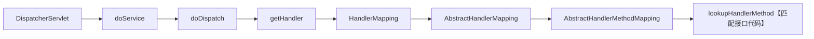

# 请求分析

## 请求路径MVC

```mermaid
flowchart LR
    A[DispatcherServlet] --> B[doService]
    B --> C[doDispatch]
    C --> D[getHandler]
    D --> E[HandlerMapping]
    E --> F[AbstractHandlerMapping]
    F --> G[AbstractHandlerMethodMapping]
    G --> H[lookupHandlerMethod【匹配接口代码】]
```
