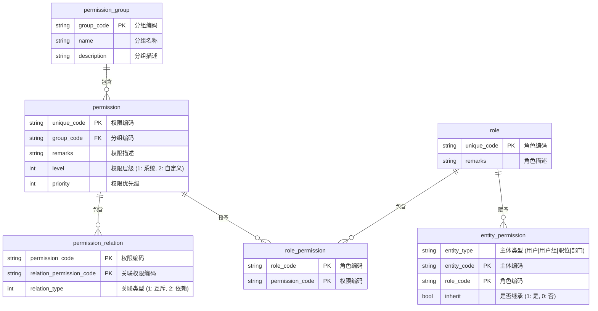

## 权限的设计

> 权限的设计遵循RBAC模型，即基于角色的访问控制（Role-Based Access Control）。

### 表结构

- 权限组（permission_group）: 权限组，用于对权限进行分组。
    - unique_code: （权限组编码）。
    - name: （权限组名称）。
    - remarks: （权限组描述）。
- 权限表（permission）：记录权限的名称、描述、类型等。
    - unique_code: 权限编码，用于权限的唯一标识。
    - permission_group_code: 权限组编码。
    - remarks：权限的描述。
    - level: 权限的优先级。
- 权限关系表（permission_relation）：记录权限与角色的关系。互斥关系、依赖关系。
    - permission_code: 权限编码。
    - relation_permission_code: 关联权限编码。
    - relation_type: 关联类型，1：互斥，2：依赖。
- 角色表（role）：记录角色的名称、描述等。
    - unique_code: 角色编码，用于角色的唯一标识。
    - name: 角色名称。
    - remarks：角色的描述。
- 角色和权限关系表（role_permission）：记录角色与权限的关系。
    - role_code: 角色编码。
    - permission_code: 权限编码。
- 主体授权表（entity_permission）：记录主体与权限的关系。
    - entity_type: 主体类型，用户|用户组|职位|部门。
    - entity_code: 主体编码。
    - role_code: 角色编码。
    - inherit: 是否继承，1：是，0：否。
    - resource_type: 资源类型，菜单|按钮|文件|管理
    - resource_code: 资源编码。

### 权限的范畴

权限主要分为`菜单权限`、`按钮权限`、`接口权限`、`路由权限`、`资源权限（文件权限）`。

- 菜单权限：用于控制用户可以访问的菜单。
- 按钮权限：用于控制用户可以操作按钮的权限。
- 文件权限：用于控制用户可以访问的文件。
- 接口权限：用于控制用户可以访问的接口。

