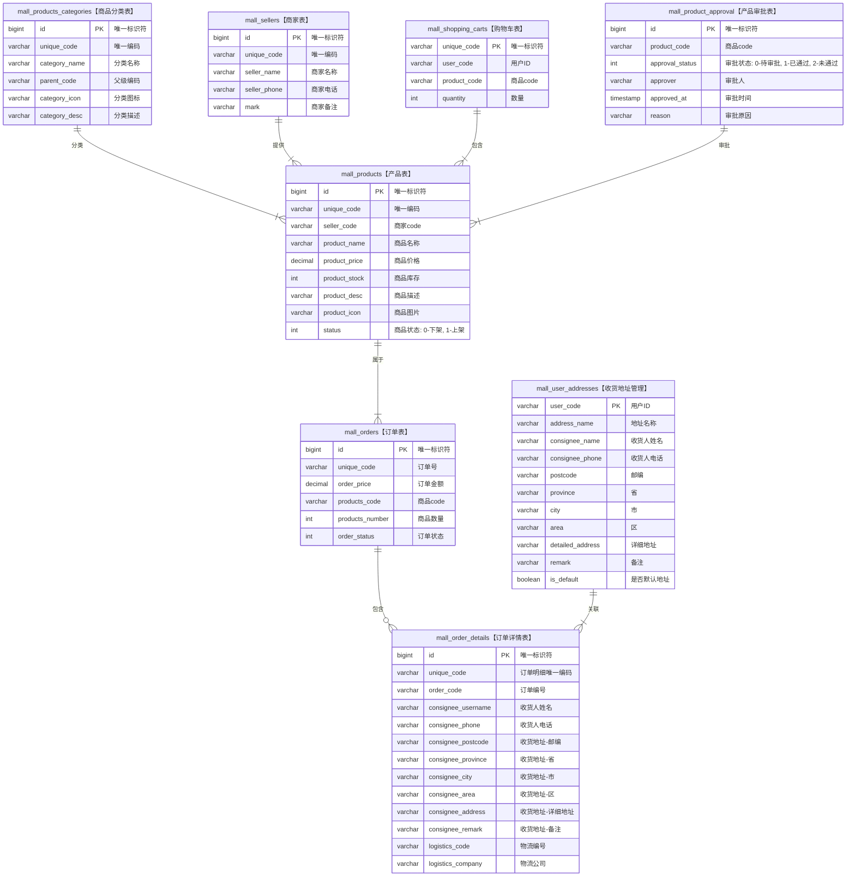
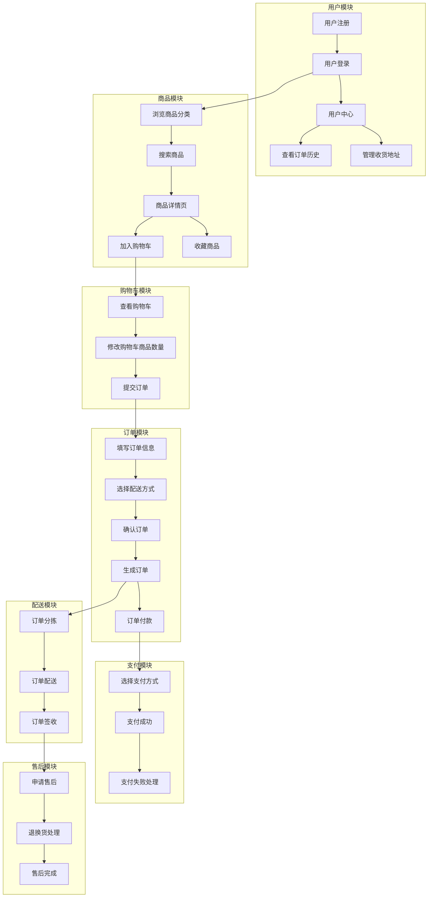

# 商城系统设计

## 数据库表设计

```sql
create table mall_order_details
(
    id                 bigint auto_increment
        primary key,
    unique_code        varchar(64)                            not null comment '唯一编码',
    order_code         varchar(64)                            not null comment '订单code',
    consignee_username varchar(64)                            not null comment '收货人姓名',
    consignee_phone    varchar(64)                            not null comment '收货人电话',
    consignee_postcode varchar(64)                            not null comment '收货地址-邮编',
    consignee_province varchar(64)                            not null comment '收货地址-省',
    consignee_city     varchar(64)                            not null comment '收货地址-市',
    consignee_area     varchar(64)                            not null comment '收货地址-区',
    consignee_address  varchar(256)                           not null comment '收货地址-详细地址',
    consignee_remark   varchar(256) default ''                null comment '收货地址-备注',
    logistics_code     varchar(64)  default ''                null comment '物流编号',
    logistics_company  varchar(64)  default ''                null comment '物流公司',
    create_by          bigint                                 null comment '创建人',
    create_time        datetime     default CURRENT_TIMESTAMP null comment '创建时间',
    update_by          bigint                                 null comment '更新人',
    update_time        datetime     default CURRENT_TIMESTAMP null comment '更新时间',
    deleted            int          default 0                 null comment '是否删除, 0未删除 1已删除'
) comment '订单明细表';

create table mall_orders
(
    id              bigint auto_increment
        primary key,
    unique_code     varchar(64)                        not null comment '订单号',
    order_price     decimal(10, 2)                     not null comment '订单金额',
    products_code   varchar(256)                       not null comment '商品code',
    products_number int      default 0                 null comment '商品数量',
    order_status    int      default 0                 null comment '订单状态, 0待支付 1待发货 2待收货 3待评价 4已完成 5已取消',
    create_by       bigint                             null comment '创建人',
    create_time     datetime default CURRENT_TIMESTAMP null comment '创建时间',
    update_by       bigint                             null comment '更新人',
    update_time     datetime default CURRENT_TIMESTAMP null comment '更新时间',
    deleted         int      default 0                 null comment '是否删除, 0未删除 1已删除'
) comment '订单表';

create table mall_products
(
    id            bigint auto_increment
        primary key,
    unique_code   varchar(64)                            not null comment '唯一编码',
    seller_code   varchar(64)                            not null comment '商家code',
    product_name  varchar(128)                           not null comment '商品名称',
    product_price decimal(10, 2)                         not null comment '商品价格',
    product_stock int                                    not null comment '商品库存',
    product_desc  varchar(256) default ''                null comment '商品描述',
    product_icon  varchar(256) default ''                null comment '商品图片',
    status        int          default 0                 null comment '商品状态, 0下架 1上架',
    create_by     bigint                                 null comment '创建人',
    create_time   datetime     default CURRENT_TIMESTAMP null comment '创建时间',
    update_by     bigint                                 null comment '更新人',
    update_time   datetime     default CURRENT_TIMESTAMP null comment '更新时间',
    deleted       int          default 0                 null comment '是否删除, 0未删除 1已删除'
) comment '商品表';

create table mall_products_categories
(
    id            bigint auto_increment
        primary key,
    unique_code   varchar(64)                            not null comment '唯一编码',
    category_name varchar(128)                           not null comment '分类名称',
    parent_code   varchar(64)  default '0'               null comment '父级编码',
    category_icon varchar(256) default ''                null comment '分类图标',
    category_desc varchar(256) default ''                null comment '分类描述',
    create_by     bigint                                 null comment '创建人',
    create_time   datetime     default CURRENT_TIMESTAMP null comment '创建时间',
    update_by     bigint                                 null comment '更新人',
    update_time   datetime     default CURRENT_TIMESTAMP null comment '更新时间',
    deleted       int          default 0                 null comment '是否删除, 0未删除 1已删除'
) comment '商品分类表';

create table mall_sellers
(
    id           bigint auto_increment
        primary key,
    unique_code  varchar(64)                        not null comment '唯一编码',
    seller_name  varchar(128)                       not null comment '商家名称',
    seller_phone varchar(32)                        not null comment '商家电话',
    mark         varchar(256)                       null comment '商家备注',
    create_by    bigint                             null comment '创建人',
    create_time  datetime default CURRENT_TIMESTAMP null comment '创建时间',
    update_by    bigint                             null comment '更新人',
    update_time  datetime default CURRENT_TIMESTAMP null comment '更新时间',
    deleted      int      default 0                 null comment '是否删除, 0未删除 1已删除'
) comment '商家表';

create table mall_shopping_carts
(
    id           bigint auto_increment
        primary key,
    unique_code  varchar(64)                        not null comment '唯一编码',
    user_code    varchar(64)                        not null comment '用户ID',
    product_code varchar(128)                       not null comment '商品ID',
    quantity     int      default 1                 null comment '数量',
    create_by    bigint                             null comment '创建人',
    create_time  datetime default CURRENT_TIMESTAMP null comment '创建时间',
    update_by    bigint                             null comment '更新人',
    update_time  datetime default CURRENT_TIMESTAMP null comment '更新时间',
    deleted      int      default 0                 null comment '是否删除, 0未删除 1已删除'
) comment '购物车表';

create table mall_user_addresses
(
    id                 bigint auto_increment
        primary key,
    unique_code        varchar(64)                            not null comment '唯一编码',
    consignee_username varchar(64)                            not null comment '收货人姓名',
    consignee_phone    varchar(64)                            not null comment '收货人电话',
    consignee_postcode varchar(64)                            not null comment '收货地址-邮编',
    consignee_province varchar(64)                            not null comment '收货地址-省',
    consignee_city     varchar(64)                            not null comment '收货地址-市',
    consignee_area     varchar(64)                            not null comment '收货地址-区',
    consignee_address  varchar(256)                           not null comment '收货地址-详细地址',
    consignee_remark   varchar(256) default ''                null comment '收货地址-备注',
    is_default         int          default 0                 null comment '是否默认, 0否 1是',
    create_by          bigint                                 null comment '创建人',
    create_time        datetime     default CURRENT_TIMESTAMP null comment '创建时间',
    update_by          bigint                                 null comment '更新人',
    update_time        datetime     default CURRENT_TIMESTAMP null comment '更新时间',
    deleted            int          default 0                 null comment '是否删除, 0未删除 1已删除'
) comment '收货地址管理';
```



## 整体业务流程图


