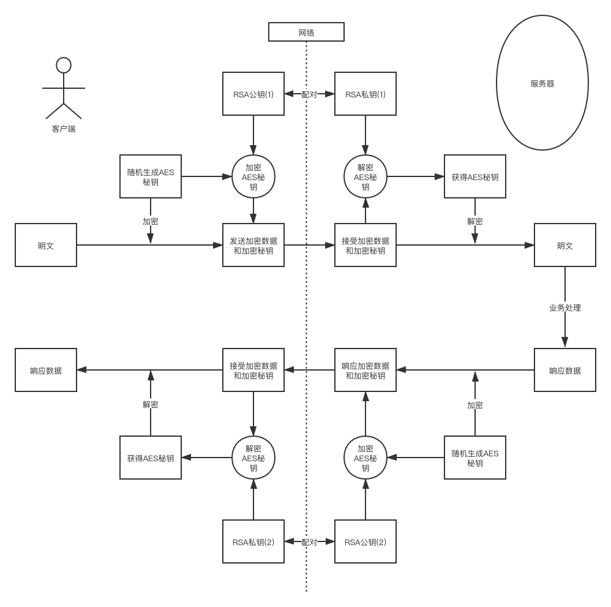
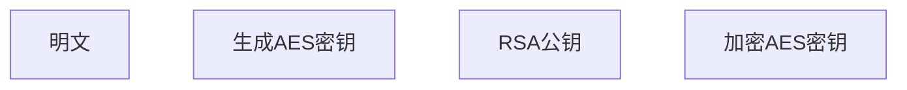

# Api加解密

## 设计方案

> 需求背景: 保证请求的数据安全，防止通过抓包获取数据。使用场景：官网数据、引流开发的游客访问资源等。

加密方案：采用RSA+AES混合加密方式。原因：非对称加密加密大文本的性能差，对称加密又容易破解。

### 实现方案

```mermaid
flowchart TB
  A[明文]
  B[生成AES密钥]
  C[RSA公钥]
  D[加密AES密钥]


%%  A[用户输入数据] -->|生成随机AES密钥| B[生成AES密钥]
%%  B -->|使用AES加密数据| C[加密数据]
%%  C --> D[加密后的数据]
%%  A -->|使用RSA公钥加密AES密钥| E[加密AES密钥]
%%  E --> F[加密后的AES密钥]
%%  D --> G[传输加密数据]
%%  F --> G
%%  G --> H[接收方]
%%  H -->|使用RSA私钥解密AES密钥| I[解密AES密钥]
%%  I -->|使用解密的AES密钥解密数据| J[解密后的数据]
%%  J --> K[显示给用户]
```
