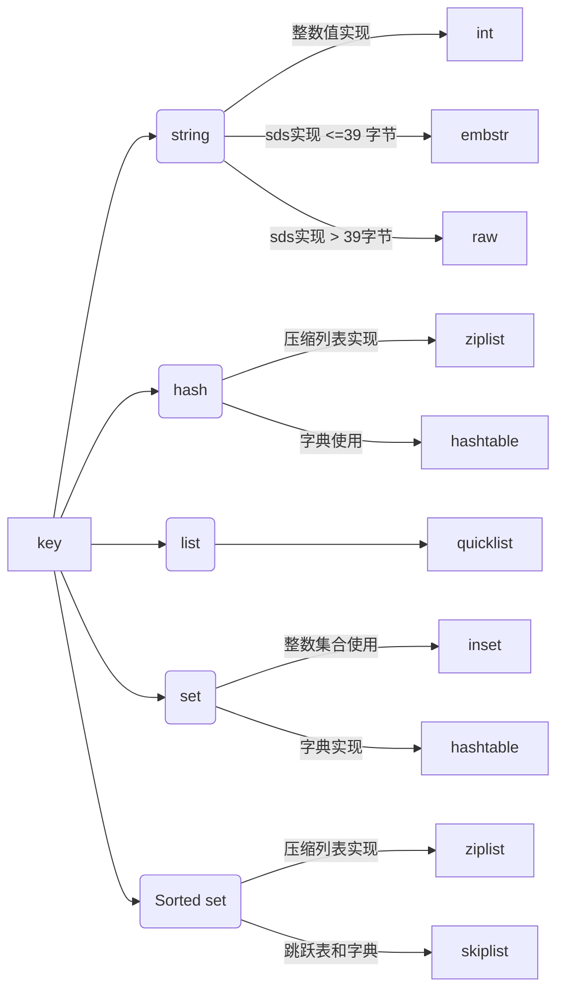

<!-- more -->
[[toc]]

## 缓存通识

- 缓存(Cache) 和 缓冲(Buffer) 的分别？

  > 缓存：一般是为了数据多次读取。
  >
  > 缓冲：比如 CPU 写到 把数据先硬盘，因为硬盘比较慢，先到缓冲设备 Buffer，比如内存，Buffer 读和写都需要。

- 缓存的关键指标：缓存命中率

  > 缓存是否有效依赖于能多少次重用同一个缓存响应业务请求，这个度量指标被称作缓存命中率。
  >
  > 如果查询一个缓存，十次查询九次能够得到正确结果，那么它的命中率是 90%.

- 影响缓存命中率的主要指标

  > 缓存键集合大小
  >
  > 缓存可使用内存空间缓存对象生存时间
  >
  > 缓存对象生存时间

- **缓存类型**
  - 代理缓存
  - 反向代理缓存
  - 多层反向代理缓存
  - 内容分发网络（`CDN - Content Distribution Network`）
  - `CDN` 同时配置静态文件和动态内容
  - 通读缓存（`Read-Through`）
  - 旁路缓存（`Cache-Aside`）
  - 浏览器对象缓存
  - 本地对象缓存
  - 远程分布式对象缓存
  - 各种介质数据访问延迟
  - 技术栈各个层次的缓存
- 缓存为什么能显著提升性能
  > 缓存数据通常来自内存，比磁盘上的数据有更快的访问速度。
  >
  > 缓存存储数据的最终结果形态，不需要中间计算，减少 CPU 资源的消耗。
  >
  > 缓存降低数据库、磁盘、网络的负载压力，使这些 I/O 设备获得更好的响应特性。

## 查看 Redis 内存统计

```shell
127.0.0.1:6379> info memory
# Memory
#Redis分配的内存总量,包括虚拟内存(字节)
used_memory:829760
used_memory_human:810.31K
#占操作系统的内存,不包括虚拟内存(字节)
used_memory_rss:4841472
used_memory_peak:3597264
used_memory_peak_human:3.43M
used_memory_lua:36864
#内存碎片比例 如果小于1说明使用了虚拟内存
mem_fragmentation_ratio:5.83
#Redis使用的内存分配器
mem_allocator:jemalloc-3.6.0
```

> Redis 服务器中的内存碎片已经很大,可以通过安全重启的方式减小内存碎片:因为重启之后,Redis 重新从备份文件中读取数据,在内存中进行重排,为每个数据重新选择合适的内存单元,减小内存碎片。

## **内存分配器`jemalloc`**

> Redis 在编译时便会指定内存分配器；
>
> 内存分配器可以是 libc 、jemalloc 或者 tcmalloc，默认是：jemalloc
>
> jemalloc 作为 Redis 的默认内存分配器，在减小内存碎片方面做的相对比较好。
>
> jemalloc 在 64 位系统 中，将内存空间划分为小、大、巨大三个范围；
>
> 每个范围内又划分了许多小的内存块单位；
>
> 当 Redis 存 储数据时，会选择大小最合适的内存块进行存储。
>
> 这样划分:技能保证充分利用内存空间,又能保证我们的性能使用

| category | spacing | size                      |
| -------- | ------- | ------------------------- |
| small    | 8       | [8]                       |
|          | 16      | [16,32,...,128]           |
|          | 32      | [160,192,224,256]         |
|          | 64      | [320,384,448,512]         |
|          | 128     | [640,768,896,1024]        |
|          | 256     | [1280,1536,1792,2048]     |
|          | 512     | [2560,3072,3584]          |
| Large    | 4 KiB   | [4KB,8KB,12KB,...,4073KB] |
| Huge     | 4 MiB   | [4MB,8MB,12MB,...]        |

> 例如,如果需要存储大小为 130 字节的对象,`jemalloc`会将其放入 160 字节的内存单元中。

## 存储对象`redisObject`

> Redis 对象有 5 种类型;无论是哪种类型,Redis 都不会直接存储,而是通过 redisObject 对象进行存储。
>
> redisObject 对象非常重要,Redis 对象的类型、内部编码、内存回收、共享对象等功能,都需要。

```c
{
    unsigned type:4;
  unsigned encoding:4;//编码
    void *ptr;//指向底层实现数据结构的指针
    //...
    int refcount;//引用计数
    //...
    unsigned lru:24;//记录最后一次被命令程序访问的时间
    //...
}robj;
```

- type

  > type 字段表示对象的类型,占 4 个比特;
  >
  > 目前包括 REDIS_STRING(字符串)、REDIS_LIST (列表)、REDIS_HASH(哈希)、REDIS_SET(集合)、REDIS_ZSET(有序集合)。
  > 当我们执行 type 命令时,便是通过读取 RedisObject 的 type 字段获得对象的类型;

- encoding

  > encoding 表示对象的内部编码,占 4 个比特。
  >
  > 对于 Redis 支持的每种类型,都有至少两种内部编码,例如对于字符串,有 int、embstr、raw 三种编
  > 码。

  ```shell
  127.0.0.1:6379> object encoding name
  "embstr"
  ```

- ptr

  > ptr 指针指向具体的数据,如前面的例子中,set hello world，ptr 指向包含字符串 world 的 SDS。

- refcount

  > refcount 记录的是该对象被引用的次数,类型为整型。refcount 的作用,主要在于对象的引用计数和内
  > 存回收。
  >
  > 当创建新对象时,refcount 初始化为 1;当有新程序使用该对象时,refcount 加 1;当对象不再被一个新程序使用时,refcount 减 1;当 refcount 变为 0 时,对象占用的内存会被释放。
  >
  > Redis 中被多次使用的对象(refcount>1),称为共享对象。Redis 为了节省内存,当有一些对象重复出现
  > 时,新的程序不会创建新的对象,而是仍然使用原来的对象。这个被重复使用的对象,就是共享对象。
  > 目前共享对象仅支持整数值的字符串对象。
  >
  > Redis 的共享对象目前只支持整数值的字符串对象。之所以如此,实际上是对内存和 CPU(时间)的平
  > 衡:共享对象虽然会降低内存消耗,但是判断两个对象是否相等却需要消耗额外的时间。对于整数值,
  > 判断操作复杂度为 O(1);对于普通字符串,判断复杂度为 O(n);而对于哈希、列表、集合和有序集合,
  > 判断的复杂度为 O(n^2)。
  > 虽然共享对象只能是整数值的字符串对象,但是 5 种类型都可能使用共享对象(如哈希、列表等的元素
  > 可以使用)。就目前的实现来说,Redis 服务器在初始化时,会创建 10000 个字符串对象,值分别是 0~9999 的整数
  > 值;当 Redis 需要使用值为 0~9999 的字符串对象时,可以直接使用这些共享对象。10000 这个数字可以
  > 通过调整参数 REDIS_SHARED_INTEGERS(4.0 中是 OBJ_SHARED_INTEGERS)的值进行改变。

  ```shell
  127.0.0.1:6379> set k1 999
  OK
  127.0.0.1:6379> set k2 999
  OK
  127.0.0.1:6379> set k3 999
  OK
  127.0.0.1:6379> object refcount k1
  (integer) 4
  127.0.0.1:6379> set k4 10000
  OK
  127.0.0.1:6379> set k5 10000
  OK
  127.0.0.1:6379> set k6 10000
  OK
  127.0.0.1:6379> object refcount k4
  (integer) 1
  ```

- lru

  > lru 记录的是对象最后一次被命令程序访问的时间,占据的比特数不同的版本有所不同(2.6 版本占 22 比
  > 特,4.0 版本占 24 比特)。通过对比 lru 时间与当前时间,可以计算某个对象的闲置时间;object idletime 命令可以显示该闲置时间(单位是秒)

  ```
  127.0.0.1:6379> object idletime k1
  (integer) 24131
  127.0.0.1:6379> object idletime k1
  (integer) 24139
  ```

- 总结

  > 综上所述,redisObject 的结构与对象类型、编码、内存回收、共享对象都有关系;一个 redisObject 对
  > 象的大小为 16 字节:
  >
  > 4bit+4bit+24bit+4Byte+8Byte=16Byte

## 动态字符串`SDS k-v`

> SDS 是简单动态字符串(Simple Dynamic String)的缩写。
>
> Redis 没有直接使用 C 字符串(即以空字符’\0’结尾的字符数组)作为默认的字符串表示,而是使用了 SDS。

3.2 之前

```C
struct sdshdr{
    //记录buf数组中已使用字节的数量
    //等于 SDS 保存字符串的长度
    int len;
    //记录 buf 数组中未使用字节的数量
    int free;
    //字节数组,用于保存字符串
    char buf[];
}
```

> 其中,buf 表示字节数组,用来存储字符串;len 表示 buf 已使用的长度,free 表示 buf 未使用的长度。
>
> buf 数组的长度=free+len+1(其中 1 表示字符串结尾的空字符);
>
> 所以,一个 SDS 结构占据的空间为：free 所占长度+len 所占长度+ buf 数组的长度+1=4+4+字符串长度+1=字符串长度+9。

3.2 之后

```c
typedef char *sds;
struct __attribute__ ((__packed__)) sdshdr5 {     // 对应的字符串长度小于 1<<32字节
    unsigned char flags; /* 3 lsb of type, and 5 msb of string length int embstr*/
    char buf[];
};
struct __attribute__ ((__packed__)) sdshdr8 {     // 对应的字符串长度小于 1<<8
    uint8_t len; /* used */                       //目前字符创的长度 用1字节存储
    uint8_t alloc;                                //已经分配的总长度 用1字节存储
    unsigned char flags;                          //flag用3bit来标明类型,类型
    char buf[];                                   //柔性数组,以'\0'结尾
};
struct __attribute__ ((__packed__)) sdshdr16 {    // 对应的字符串长度小于 1<<16
    uint16_t len; /*已使用长度,用2字节存储*/
    uint16_t alloc; /* 总长度,用2字节存储*/
    unsigned char flags; /* 3 lsb of type, 5 unused bits*/
    char buf[];
};
struct __attribute__ ((__packed__)) sdshdr32 {    // 对应的字符串长度小于 1<<32
    uint32_t len; /*已使用长度,用4字节存储*/
    uint32_t alloc; /* 总长度,用4字节存储*/
    unsigned char flags;/* 低3位存储类型, 高5位预留 */
    char buf[];/*柔性数组,存放实际内容*/
};
struct __attribute__ ((__packed__)) sdshdr64 {    // 对应的字符串长度小于 1<<64
    uint64_t len; /*已使用长度,用8字节存储*/
    uint64_t alloc; /* 总长度,用8字节存储*/
    unsigned char flags; /* 低3位存储类型, 高5位预留 */
    char buf[];/*柔性数组,存放实际内容*/
};
```

SDS 与 C 字符串的比较

- 获取字符串长度:SDS 是 O(1),C 字符串是 O(n)
- 缓冲区溢出:使用 C 字符串的 API 时,如果字符串长度增加(如 strcat 操作)而忘记重新分配内存,很容易造成缓冲区的溢出;而 SDS 由于记录了长度,相应的 API 在可能造成缓冲区溢出时会自动重新分配内存,杜绝了缓冲区溢出。
- 修改字符串时内存的重分配:对于 C 字符串,如果要修改字符串,必须要重新分配内存(先释放再申请),因为如果没有重新分配,字符串长度增大时会造成内存缓冲区溢出,字符串长度减小时会造成内存泄露。而对于 SDS,由于可以记录 len 和 free,因此解除了字符串长度和空间数组长度之间的关联,可以在此基础上进行优化:空间预分配策略(即分配内存时比实际需要的多)使得字符串长度增大时重新分配内存的概率大大减小;惰性空间释放策略使得字符串长度减小时重新分配内存的概率大大减小。
- 存取二进制数据:SDS 可以,C 字符串不可以。因为 C 字符串以空字符作为字符串结束的标识,而对于一些二进制文件(如图片等),内容可能包括空字符串,因此 C 字符串无法正确存取;而 SDS 以字符串长度 len 来作为字符串结束标识,因此没有这个问题。

此外,由于 SDS 中的 buf 仍然使用了 C 字符串(即以’\0’结尾),因此 SDS 可以使用 C 字符串库中的部分函
数;但是需要注意的是,只有当 SDS 用来存储文本数据时才可以这样使用,在存储二进制数据时则不行
(’\0’不一定是结尾)。

## **Redis 的对象类型与内存编码**

Redis 支持 5 种对象类型,而每种结构都有至少两种编码;

> 一方面接口与实现分离，当需要增加或改变内部编码时，用户使用不受影响;
>
> 另一方面可以根据不同的应用场景切换内部编码，提高效率。



| 类型       | 编码       | 对象                       |
| ---------- | ---------- | -------------------------- |
| String     | int        | 整数值实现                 |
|            | embstr     | sds 实现 <=39 字节         |
|            | raw        | sds 实现 > 39 字节         |
| List       | ziplist    | 压缩列表实现(3.0 版本之前) |
|            | linkedlist | 双端链表实现(3.0 版本之前) |
|            | quicklist  | 新的数据格式(3.2 版本之后) |
| Set        | intset     | 整数集合使用               |
|            | hashtable  | 字典实现                   |
| Hash       | ziplist    | 压缩列表实现               |
|            | hashtable  | 字典使用                   |
| Sorted set | ziplist    | 压缩列表实现               |
|            | skiplist   | 跳跃表和字典               |

- 字符串`string`（SDS）

  > 字符串长度不能超过 512MB。

  > 字符串类型的内部编码有 3 种,它们的应用场景如下:
  >
  > - int：8 个字节的长整型。字符串值是整型时,这个值使用 long 整型表示。
  > - embstr:<=44 字节的字符串。embstr 与 raw 都使用 redisObject 和 sds 保存数据,区别在于,embstr 的使用只分配一次内存空间(因此 redisObject 和 sds 是连续的),而 raw 需要分配两次内存空间(分别为 redisObject 和 sds 分配空间)。因此与 raw 相比,embstr 的好处在于创建时少分配一次空间,删除时少释放一次空间,以及对象的所有数据连在一起,寻找方便。而 embstr 的坏处也很明显,如果字符串的长度增加需要重新分配内存时,整个 redisObject 和 sds 都需要重新分配空间,因此 redis 中的 embstr 实现为只读。
  > - raw:大于 44 个字节的字符串

  > 3.2 之后 embstr 和 raw 进行区分的长度,是 44;是因为 redisObject 的长度是 16 字节,sds 的长度
  > 是 4+字符串长度;因此当字符串长度是 44 时,embstr 的长度正好是 16+4+44 =64,jemalloc 正好
  > 可以分配 64 字节的内存单元。
  > 3.2 之前 embstr 和 raw 进行区分的长度,是 39,因为 redisObject 的长度是 16 字节,sds 的长度是
  > 9+字符串长度;因此当字符串长度是 39 时,embstr 的长度正好是 16+9+39 =64,jemalloc 正好可
  > 以分配 64 字节的内存单元。

- 列表 `list`

  > 列表(list)用来存储多个有序的字符串,每个字符串称为元素;一个列表可以存储 2^32-1 个元素。
  >
  > Redis 中的列表支持两端插入和弹出,并可以获得指定位置(或范围)的元素,可以充当数组、队列、栈等。

  Redis3.0 之前列表的内部编码可以是`压缩列表`(ziplist)或`双端链表`(linkedlist)。

  选择的折中方案是两种数据类型的转换,但是在 3.2 版本之后 因为转换也是个费时且复杂的操作,引入了一种新的数据格式,结合了双向列表 linkedlist 和 ziplist 的特点,称之为 quicklist。所有的节点都用 quicklist 存储,省去了到临界条件是的格式转换。

  - 压缩列表 `ziplist`(3.0 版本之前)

    > 列表键和哈希键的底层实现之一。当一个列表只包含少量列表项时,并且每个列表项时小整数值或短字符串,那么 Redis 会使用压缩列表来做该列表的底层实现。
    >
    > Redis 为了节省内存而开发的,是由一系列特殊编码的连续内存块组成的顺序型数据结构,一个压缩列表可以包含任意多个节点(entry),每个节点可以保存一个字节数组或者一个整数值,放到一个连续内存区。
    >
    > - previous_entry_ength: 记录压缩列表前一个字节的长度。
    > - encoding:节点的 encoding 保存的是节点的 content 的内容类型。
    > - content:content 区域用于保存节点的内容,节点内容类型和长度由 encoding 决定。

  - 双向链表 `linkedlist`(3.0 版本之前)

    > 双向链表(linkedlist):由一个 list 结构和多个 listNode 结构组成;
    >
    > 双端链表同时保存了表头指针和表尾指针,并且每个节点都有指向前和指向后的指针;链表中保存了列表的长度;dup、free 和 match 为节点值设置类型特定函数,所以链表可以用于保存各种不同类型的值。而链表中每个节点指向的是 type 为字符串的 redisObject。

  - `quicklist`(3.2 版本之后)

    > 简单的说,我们仍旧可以将其看作一个双向列表,但是列表的每个节点都是一个 ziplist,其实就是 linkedlist 和 ziplist 的结合。quicklist 中的每个节点 ziplist 都能够存储多个数据元素。

    ```c
    //32byte 的空间
    typedef struct quicklist {
        // 指向quicklist的头部
        quicklistNode *head;       // 指向quicklist的尾部
        quicklistNode *tail;
        unsigned long count;    // 列表中所有数据项的个数总和
        unsigned int len;   // quicklist节点的个数,即ziplist的个数
        // ziplist大小限定,由list-max-ziplist-size给定
        // 表示不用整个int存储fill,而是只用了其中的16位来存储
        int fill : 16;
        unsigned int compress : 16;  // 节点压缩深度设置,由list-compress-depth给定
    } quicklist;
    typedef struct quicklistNode {
        struct quicklistNode *prev;  // 指向上一个ziplist节点
        struct quicklistNode *next;  // 指向下一个ziplist节点
        unsigned char *zl;           // 数据指针,如果没有被压缩,就指向ziplist结构,反之指向quicklistLZF结构
        unsigned int sz;             // 表示指向ziplist结构的总长度(内存占用长度)
        unsigned int count : 16;     // 表示ziplist中的数据项个数
        unsigned int encoding : 2;   // 编码方式,1--ziplist,2--quicklistLZF
        unsigned int container : 2;  // 预留字段,存放数据的方式,1--NONE,2--    ziplist
        unsigned int recompress : 1; // 解压标记,当查看一个被压缩的数据时,需要暂时解压,标记此参数为1,之后再重新进行压缩
        unsigned int attempted_compress : 1;  // 测试相关
        unsigned int extra : 10;     // 扩展字段,暂时没用
    } quicklistNode;
    ```

- 哈希 `hash`（压缩列表和哈希表）

  1. 概况

     哈希(作为一种数据结构),不仅是 redis 对外提供的 5 种对象类型的一种(与字符串、列表、集合、有序结合并列),也是 Redis 作为 Key-Value 数据库所使用的数据结构。为了说明的方便,后面当使用“内层的哈希”时,代表的是 redis 对外提供的 5 种对象类型的一种;使用“外层的哈希”代指 Redis 作为 Key-Value 数据库所使用的数据结构。

  2. 内部编码

     > 内层的哈希使用的内部编码可以是压缩列表(ziplist)和哈希表(hashtable)两种;Redis 的外层的哈希则只使用了 hashtable。

     > hashtable:一个 hashtable 由 1 个 dict 结构、2 个 dictht 结构、1 个 dictEntry 指针数组(称为 bucket)和
     > 多个 dictEntry 结构组成。

  3. 编码转换

     如前所述,Redis 中内层的哈希既可能使用哈希表,也可能使用压缩列表。
     只有同时满足下面两个条件时,才会使用压缩列表:

     - 哈希中元素数量小于 512 个;
     - 哈希中所有键值对的键和值字符串长度都小于 64 字节。

- 集合 `set` (整数集合和哈希表)

  1. 概况

     > 集合(set)与列表类似,都是用来保存多个字符串,但集合与列表有两点不同:集合中的元素是无序的,因此不能通过索引来操作元素;集合中的元素不能有重复。

     > 一个集合中最多可以存储 2^32-1 个元素;除了支持常规的增删改查,Redis 还支持多个集合取交集、并集、差集。

  2. 内部编码

     > 集合的内部编码可以是整数集合(intset)或哈希表(hashtable)。

  3. 编码转换

     只有同时满足下面两个条件时,集合才会使用整数集合:

     - 集合中元素数量小于 512 个;
     - 集合中所有元素都是整数值。

- 有序集合 `zset`（压缩列表和跳跃表）

  1. 概况

     > 有序集合与集合一样，元素都不能重复；但与集合不同的是，有序集合中的元素是有顺序的。与列表使 用索引下标作为排序依据不同，有序集合为每个元素设置一个分数（score）作为排序依据。

  2. 内部编码

     > 有序集合的内部编码可以是压缩列表(ziplist)或跳跃表(skiplist)。

## Redis 设计优化（实际使用）

1. 估算**Redis**内存使用量

   > 要估算 redis 中的数据占据的内存大小，需要对 redis 的内存模型有比较全面的了解，包括第一节课介绍的 hashtable、sds、redisobject、各种对象类型的编码方式等。

   假设有 90000 个键值对,每个 key 的长度是 12 个字节,每个 value 的长度也是 12 个字节(且 key 和 value 都不是整数);

   > 下面来估算这 90000 个键值对所占用的空间。在估算占据空间之前,首先可以判定字符串类型使用的编码方式:embstr。
   >
   > 90000 个键值对占据的内存空间主要可以分为两部分:一部分是 90000 个 dictEntry 占据的空间;一部分是键值对所需要的 bucket 空间。
   >
   > 每个 dictEntry 占据的空间包括:
   >
   > - 一个 dictEntry 结构,24 字节,jemalloc 会分配 32 字节的内存块(64 位操作系统下,一个指针 8 字节,一个 dictEntry 由三个指针组成)
   > - 一个 key,12 字节,所以 SDS(key)需要 12+4=16 个字节([SDS 的长度=4+字符串长度),jemalloc 会分配 16 字节的内存块
   > - 一个 redisObject,16 字节,jemalloc 会分配 16 字节的内存块(4bit+4bit+24bit+4Byte+8Byte=16Byte)
   > - 一个 value,12 字节,所以 SDS(value)需要 12+4=16 个字节([SDS 的长度=4+字符串长度),jemalloc 会分配 16 字节的内存块
   > - 综上,一个 dictEntry 所占据的空间需要 32+16+16+16=80 个字节。
   >
   > bucket 空间:
   >
   > - bucket 数组的大小为大于 90000 的最小的 2^n,是 131072;每个 bucket 元素(bucket 中存储的都是指
   >   针元素)为 8 字节(因为 64 位系统中指针大小为 8 字节)。
   >
   > 因此,可以估算出这 90000 个键值对占据的内存大小为:[90000*80 + 131072*8 = 8248576

   > 作为对比将 key 和 value 的长度由 12 字节增加到 13 字节,则对应的 SDS 变为 17 个字节,jemalloc 会分配 32 个字节,因此每个 dictEntry 占用的字节数也由 80 字节变为 112 字节。此时估算这 90000 个键值对占据内存大小为:90000*112 + 131072*8 = 11128576。

2. 优化内存占用

   > 了解 redis 的内存模型，对优化 redis 内存占用有很大帮助。下面介绍几种优化场景和方式

   - 利用**jemalloc**特性进行优化

     上一小节所讲述的 90000 个键值便是一个例子。由于 jemalloc 分配内存时数值是不连续的,因此 key/value 字符串变化一个字节,可能会引起占用内存很大的变动;在设计时可以利用这一点。

     > 例如,如果 key 的长度如果是 13 个字节,则 SDS 为 17 字节,jemalloc 分配 32 字节;此时将 key 长度
     > 缩减为 12 个字节,则 SDS 为 16 字节,jemalloc 分配 16 字节;则每个 key 所占用的空间都可以缩小一半。

- 使用整型/长整型

  > 如果是整型/长整型,Redis 会使用 int 类型(8 字节)存储来代替字符串,可以节省更多空间。因此在可以使用长整型/整型代替字符串的场景下,尽量使用长整型/整型。

- 共享对象

  利用共享对象,可以减少对象的创建(同时减少了 redisObject 的创建),节省内存空间。目前 redis 中的共享对象只包括 10000 个整数(0-9999);可以通过调整 REDIS_SHARED_INTEGERS 参数提高共享对象的个数;

  > 例如将 REDIS_SHARED_INTEGERS 调整到 20000,则 0-19999 之间的对象都可以共享

  > 论坛网站在 redis 中存储了每个帖子的浏览数,而这些浏览数绝大多数分布在 0-20000 之间,这时候通过适当增大 EDIS_SHARED_INTEGERS 参数,便可以利用共享对象节省内存空间。

- 缩短键值对的存储长度

  键值对的长度是和性能成反比的,比如我们来做一组写入数据的性能测试,执行结果如下:

  | 数据量 | key 大小 | value 大小 | 平均耗时(string:set) | 平均耗时(hash:hset) |
  | ------ | -------- | ---------- | -------------------- | ------------------- |
  | 100w   | 20byte   | 512byte    | 1.13 微秒            | 10.28 微秒          |
  | 100w   | 20byte   | 200byte    | 0.74 微秒            | 8.08 微秒           |
  | 100w   | 20byte   | 100byte    | 0.65 微秒            | 7.92 微秒           |
  | 100w   | 20byte   | 50byte     | 0.59 微秒            | 6.74 微秒           |
  | 100w   | 20byte   | 20byte     | 0.55 微秒            | 6.60 微秒           |
  | 100w   | 20byte   | 5byte      | 0.53 微秒            | 6.53 微秒           |

  从以上数据可以看出,在 key 不变的情况下,value 值越大操作效率越慢,因为 Redis 对于同一种数据类型会使用不同的内部编码进行存储,比如字符串的内部编码就有三种:int(整数编码)、raw(优化内存分配的字符串编码)、embstr(动态字符串编码),这是因为 Redis 的作者是想通过不同编码实现效率和空间的平衡,然而数据量越大使用的内部编码就越复杂,而越是复杂的内部编码存储的性能就越低。

  这还只是写入时的速度,当键值对内容较大时,还会带来另外几个问题:

  - 内容越大需要的持久化时间就越长,需要挂起的时间越长,Redis 的性能就会越低;
  - 内容越大在网络上传输的内容就越多,需要的时间就越长,整体的运行速度就越低;
  - 内容越大占用的内存就越多,就会更频繁的触发内存淘汰机制,从而给 Redis 带来了更多的运行负担。

  因此在保证完整语义的同时,我们要尽量的缩短键值对的存储长度,必要时要对数据进行序列化和压缩再存储,以 Java 为例,序列化我们可以使用 protostuff 或 kryo，压缩我们可以使用 snappy。
