## Mermaid介绍

> Mermaid是一个基于 JavaScript 的图表绘制工具，可使用文本和代码在Markdown 或在线编辑网站快速创建可视化图表，如流程图、序列图、甘特图、饼图等。

- Mermaid使用文档：<https://mermaid.nodejs.cn/>
- 在线绘制网站：<https://mermaid.live/>
- Makedown书写软件：Typora下载地址：<https://typoraio.cn/>
- VuePress Theme Hope: <https://theme-hope.vuejs.press/zh/guide/markdown/chart/mermaid.html>

## Mermaid图形与代码

| 方向     | 代码  | 代码示例                     |
| -------- | ----- | ---------------------------- |
| 从上到下 | TB/TD | `flowchartTB`或`flowchartTD` |
| 从下到上 | BT    | `flowchartBT`                |
| 从左到右 | LR    | `flowchartLR`                |
| 从右到左 | RL    | `flowchartRL`                |

------

| 节点形状   | 代码      | 代码示例          |
| ---------- | --------- | ----------------- |
| 圆边       | `( )`     | `A(圆边框)`       |
| 体育场形状 | `([ ])`   | `A([体育场形状])` |
| 圆形       | `(( ))`   | `A((圆形))`       |
| 子程序形状 | `[[ ]]`   | `A[[子程序形状]]` |
| 菱形       | `{ }`     | `A{菱形}`         |
| 六边形     | `{{ }}`   | `A{{六边形}}`     |
| 平行四边形 | `[/ /]`   | `A[/平行四边形/]` |
| 梯形       | `[/ \]`   | `A[/正梯形\]`     |
| 倒梯形     | `[\ /]`   | `A[\倒梯形/]`     |
| 双圈       | `((( )))` | `A(((双圈)))`     |

------

| 节点之间的链接   | 链接                | 代码示例              |
| ---------------- | ------------------- | --------------------- |
| 箭头向右的链接   | `-->`               | `A --> B`             |
| 无箭头的链接     | `---`               | `A --- B`             |
| 链接上有文本     | `-- 链接上文本 ---` | `A-- 链接上文本 ---B` |
| 虚线向右的链接   | `-.-`               | `A-.->B`              |
| 箭头向右的粗链接 | `==>`               | `A ==> B`             |
| 看不见的链接     | `~~~`               | `A ~~~ B`             |

## 流程图

### 基本流程

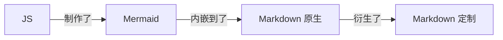
```mermaid
flowchart LR
  A["JS"]
  B["Mermaid"]
  C["Markdown 原生"]
  D["Markdown 定制"]
  A --制作了--> B --内嵌到了 --> C --衍生了--> D
```

### 排列方向

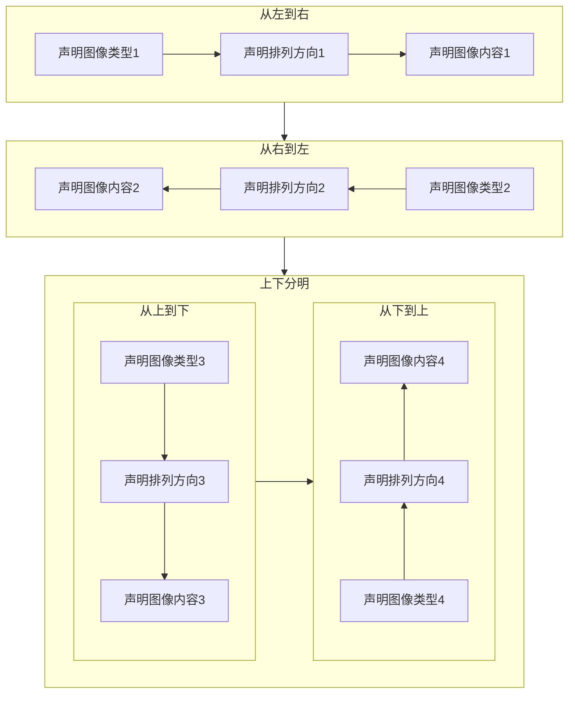
```mermaid
  flowchart TB
  subgraph 从左到右
    direction LR
    声明图像类型1 --> 声明排列方向1 --> 声明图像内容1
  end
  subgraph 从右到左
    direction RL
    声明图像类型2 --> 声明排列方向2 --> 声明图像内容2
  end
  subgraph 上下分明
    direction LR
    subgraph 从上到下
    direction TB
    声明图像类型3 --> 声明排列方向3 --> 声明图像内容3
    end
    subgraph 从下到上
    direction BT
    声明图像类型4 --> 声明排列方向4 --> 声明图像内容4
    end
    从上到下 --> 从下到上
  end
  从左到右 --> 从右到左 --> 上下分明
```

### 流程图2

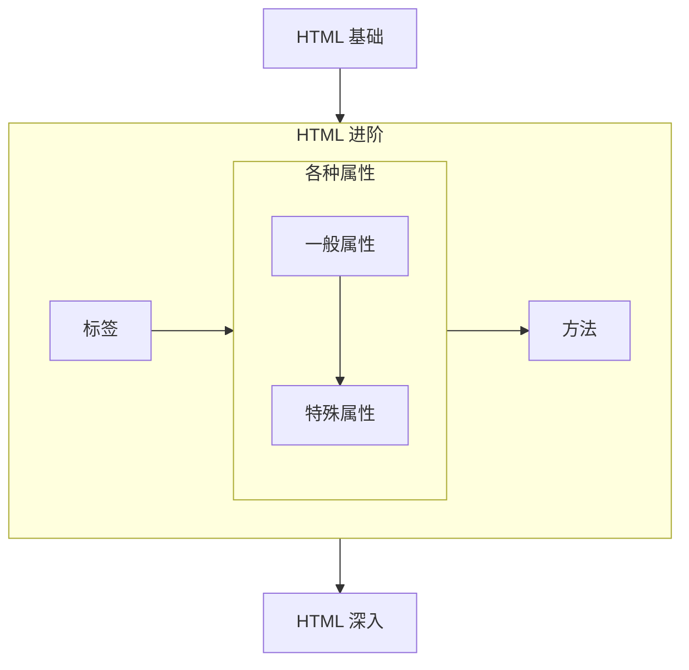
```mermaid
  graph TB
  A[HTML 基础]
  subgraph B[HTML 进阶]
    subgraph 属性[各种属性]
      一般属性 --> 特殊属性
    end
    标签 --> 属性 --> 方法
  end
  C[HTML 深入]
  A --> B --> C
```

## 时序图

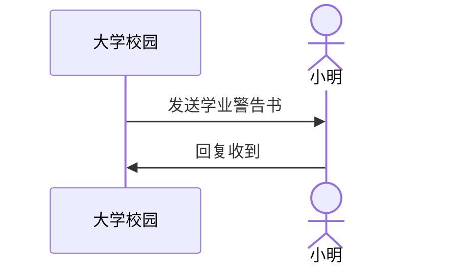
```mermaid
sequenceDiagram
  participant 机构A as 大学校园
  actor 学生A as 小明
  机构A ->> 学生A: 发送学业警告书
  学生A ->> 机构A: 回复收到
```

------

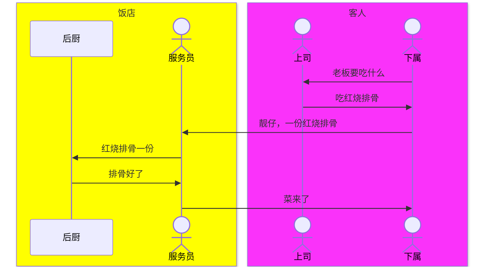
```mermaid
sequenceDiagram
  box Yellow 饭店
  participant A as 后厨
  actor B as 服务员
  end
  box rgb(250,50,250) 客人
  actor C as 上司
  actor D as 下属
  end
  D ->> C: 老板要吃什么
  C ->> D: 吃红烧排骨
  D ->> B: 靓仔，一份红烧排骨
  B ->> A: 红烧排骨一份
  A ->> B: 排骨好了
  B ->> D: 菜来了
```

## 甘特图

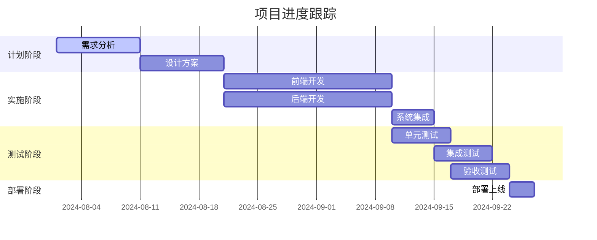
```mermaid
gantt
  title 项目进度跟踪
  dateFormat  YYYY-MM-DD
  section 计划阶段
  需求分析       :active, a1, 2024-08-01, 10d
  设计方案       : a2, after a1, 10d
  section 实施阶段
  前端开发       : a3, after a2, 20d
  后端开发       : a4, after a2, 20d
  系统集成       : a5, after a3, 5d
  section 测试阶段
  单元测试       : a6, after a4, 7d
  集成测试       : a7, after a5, 7d
  验收测试       : a8, after a6, 7d
  section 部署阶段
  部署上线       : a9, after a8, 3d

```

## 类图

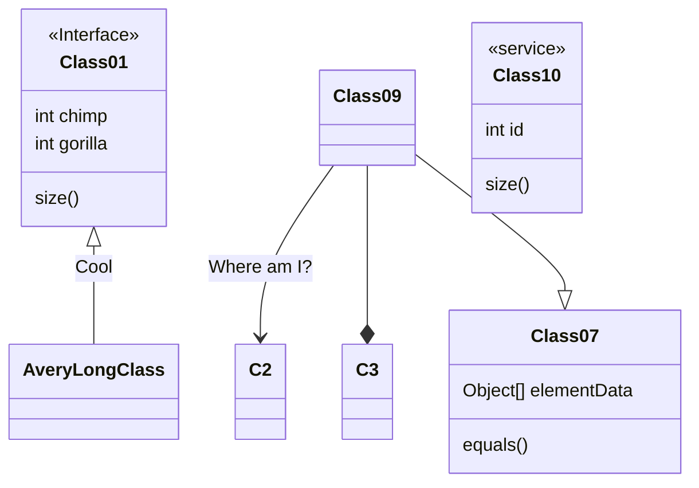
```mermaid
classDiagram
Class01 <|-- AveryLongClass : Cool
<<Interface>> Class01
Class09 --> C2 : Where am I?
Class09 --* C3
Class09 --|> Class07
Class07 : equals()
Class07 : Object[] elementData
Class01 : size()
Class01 : int chimp
Class01 : int gorilla
class Class10 {
  <<service>>
  int id
  size()
}
```

## 状态图

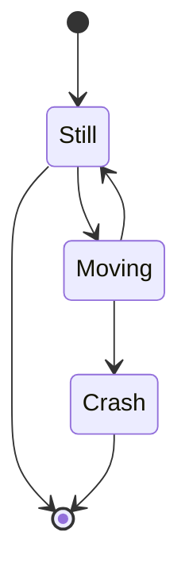
```mermaid
stateDiagram-v2
[*] --> Still
Still --> [*]
Still --> Moving
Moving --> Still
Moving --> Crash
Crash --> [*]
```

## 饼图

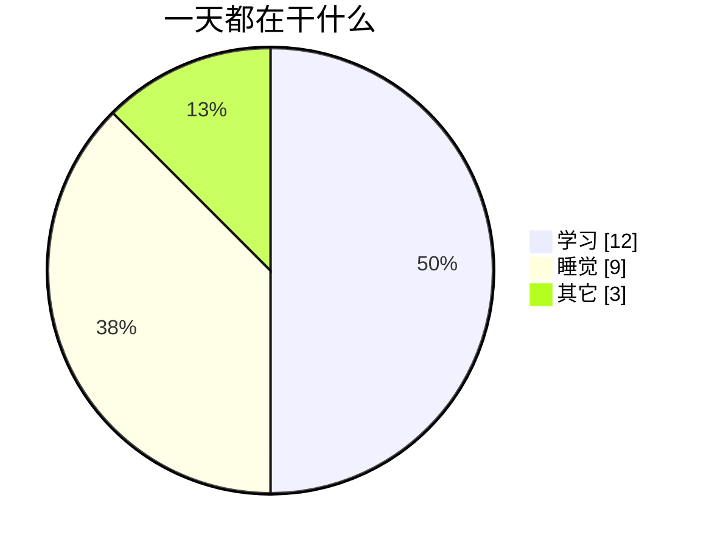
```mermaid
pie showData
  title 一天都在干什么
  "学习" : 12
  "睡觉" : 9
  "其它" : 3
```

## mindmap

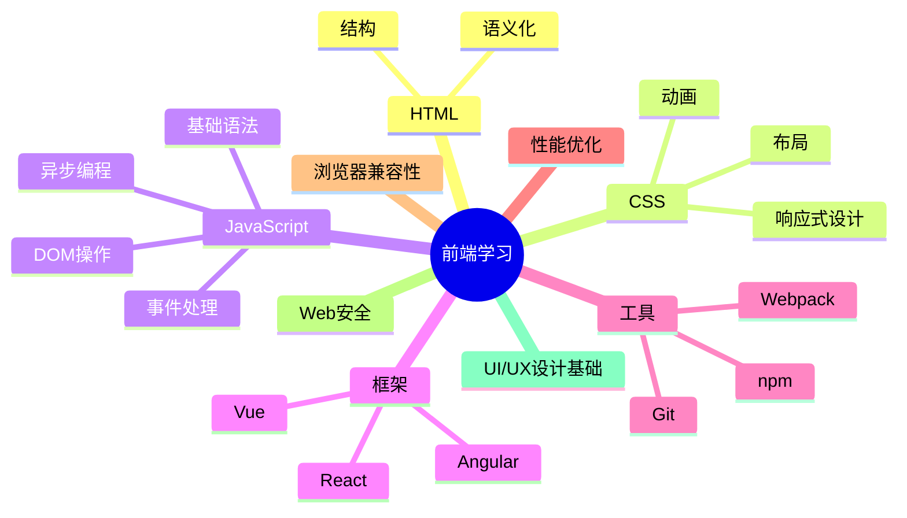
```mermaid
mindmap
  root((前端学习))
    HTML
      结构
      语义化
    CSS
      布局
      响应式设计
      动画
    JavaScript
      基础语法
      DOM操作
      事件处理
      异步编程
    框架
      React
      Vue
      Angular
    工具
      Git
      Webpack
      npm
    性能优化
    浏览器兼容性
    Web安全
    UI/UX设计基础
```

## 调整链接的长度

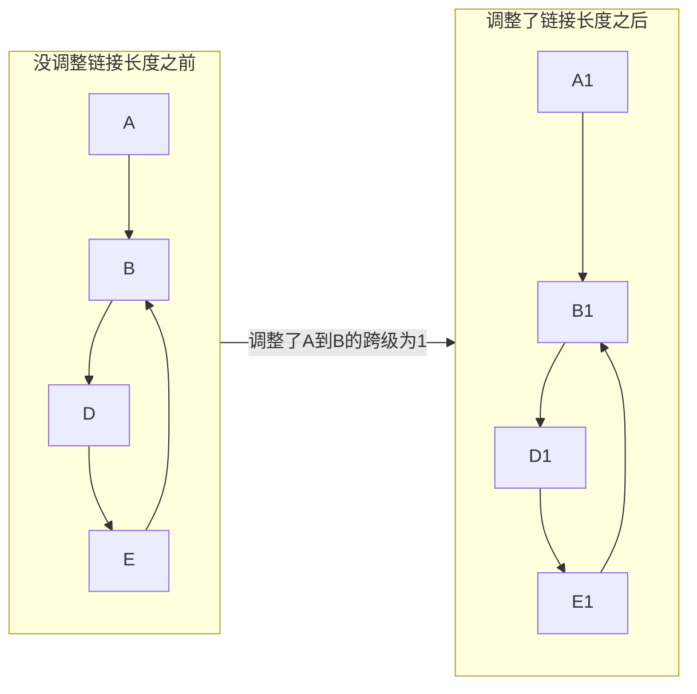
```mermaid
graph LR
  subgraph 没调整链接长度之前
    direction TB
    %% A --> B 的链接声明是正常的
    A --> B --> D
    D --> E
    E --> B
  end
  subgraph 调整了链接长度之后
    direction TB
    %% A ---> B 的链接声明多了一个 - 符号
    %% 代表着跨1个级别
    A1 ---> B1 --> D1
    D1 --> E1
    E1 --> B1
  end
  没调整链接长度之前 --调整了A到B的跨级为1--> 调整了链接长度之后
```

## 事件交互

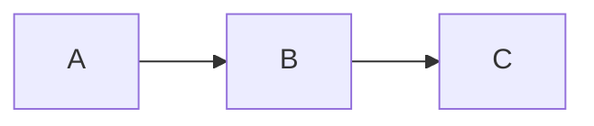
```mermaid
graph LR
  A --> B --> C
  click A callback "引入函数"
  click A call callback() "捆绑函数到节点A的点击事件"
  click B href "https://www.github.com" "前往GitHub" _blank
```

## 链接声明

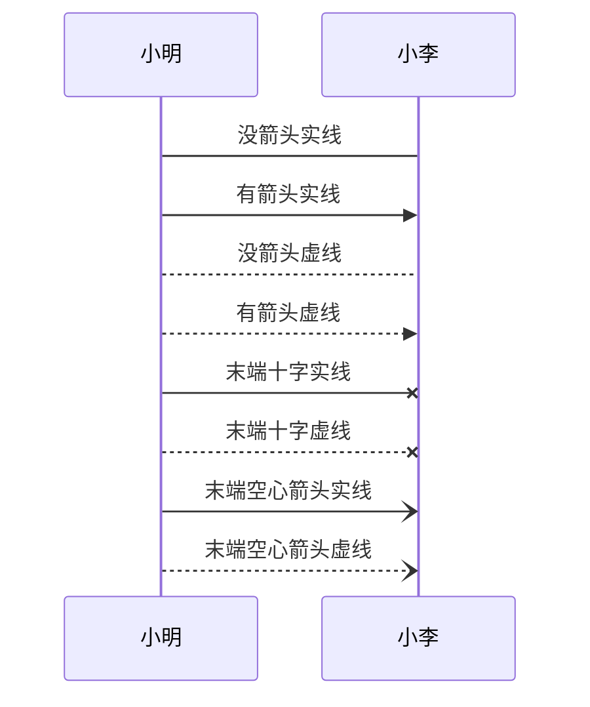
```mermaid
sequenceDiagram
  participant A as 小明
  participant B as 小李
  A -> B: 没箭头实线
  A ->> B: 有箭头实线
  A --> B: 没箭头虚线
  A -->> B: 有箭头虚线
  A -x B: 末端十字实线
  A --x B: 末端十字虚线
  A -) B: 末端空心箭头实线
  A --) B: 末端空心箭头虚线
```

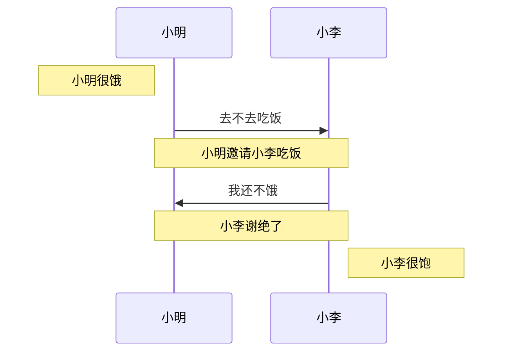
```mermaid
sequenceDiagram
  participant A as 小明
  participant B as 小李
  Note left of A: 小明很饿
  A ->> B: 去不去吃饭
  Note over A,B: 小明邀请小李吃饭
  B ->> A: 我还不饿
  Note over A,B: 小李谢绝了
  Note right of B: 小李很饱
```

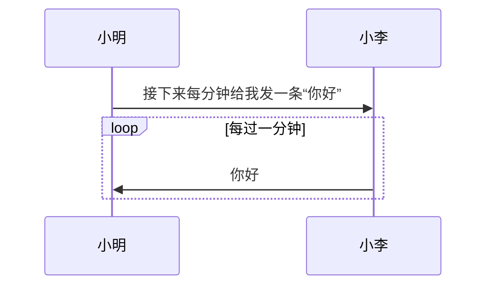
```mermaid
sequenceDiagram
  participant A as 小明
  participant B as 小李
  A ->> B: 接下来每分钟给我发一条“你好”
  loop 每过一分钟
    B ->> A: 你好
  end
```

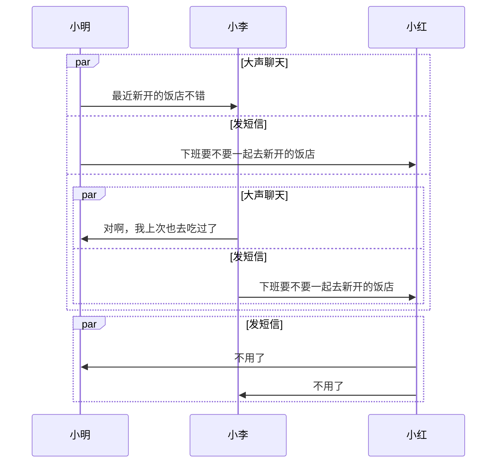
```mermaid
sequenceDiagram
  participant A as 小明
  participant B as 小李
  participant C as 小红
  par 大声聊天
    A ->> B: 最近新开的饭店不错
  and 发短信
    A ->> C: 下班要不要一起去新开的饭店
  and
    par 大声聊天
      B ->> A: 对啊，我上次也去吃过了
    and 发短信
      B ->> C: 下班要不要一起去新开的饭店
    end
  end
  par 发短信
    C ->> A: 不用了
    C ->> B: 不用了
  end
```

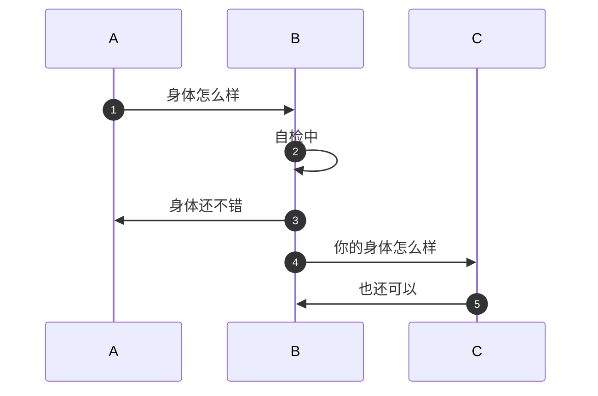
```mermaid
sequenceDiagram
  autonumber
  A ->> B: 身体怎么样
  B ->> B: 自检中
  B ->> A: 身体还不错
  B ->> C: 你的身体怎么样
  C ->> B: 也还可以
```

## 用户行程图

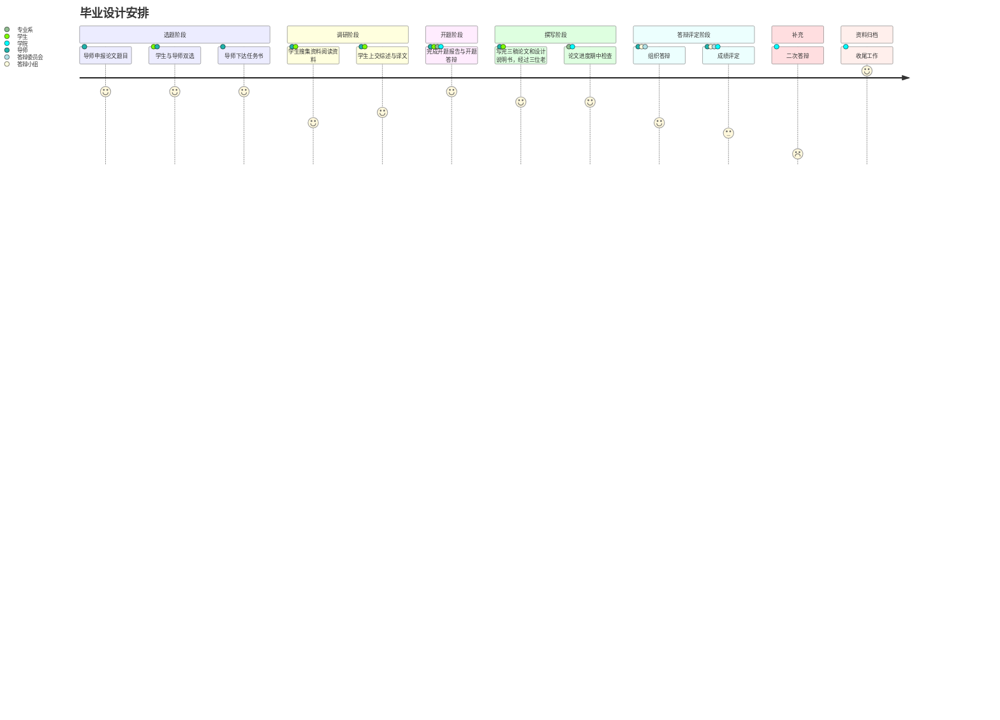
```mermaid
journey
  title 毕业设计安排
  section 选题阶段
    导师申报论文题目 : 7 : 导师
    学生与导师双选 : 7 : 学生, 导师
    导师下达任务书 : 7 : 导师
  section 调研阶段
    学生搜集资料阅读资料 : 4 : 导师, 学生
    学生上交综述与译文 : 5 : 导师, 学生
  section 开题阶段
    完成开题报告与开题答辩 : 7 : 导师, 学生, 专业系, 学院
  section 撰写阶段
    写完三稿论文和设计说明书，经过三位老师评审 : 6 : 导师, 学生
    论文进度期中检查 : 6 : 专业系, 学院
  section 答辩评定阶段
    组织答辩 : 4 : 导师, 答辩小组, 答辩委员会
    成绩评定 : 3 : 导师, 答辩小组, 答辩委员会, 学院
  section 补充
    二次答辩 : 1 : 学院
  section 资料归档
    收尾工作 : 9 : 学院
```
